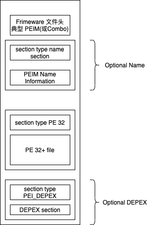

# 第 1 卷：Pre-EFI 初始化核心接口

## 1. 简介

### 1.1 概述

该规范定义了实现平台初始化 \(PI\) 规范（以下简称“PI 架构”）的 Pre-EFI 初始化 \(PEI\) 阶段所需的核心代码和服务。

此 PEI 核心接口规范 \(CIS\) 执行以下操作：

* 描述 PEI 阶段的基本组件
* 为 UEFI PI 工作组 \(PIWG\) 在架构上要求的服务和功能提供代码定义
* 描述固件执行的后续阶段所需的机器准备
* 讨论描述系统重启类型的状态变量

有关更多信息，请参阅下面的“PEI CIS 的组织”。

### 1.2 PEI CIS 的组织

该 PEI 核心接口规范的组织方式如表 1-1 所示。 由于 PEI Foundation 只是基于 PI 架构的固件解决方案的一个组件，因此本文档中引用了许多其他规范。

Table 1-1: Organization of the PEI CIS

| 章节 | 描述 |
| :--- | :--- |
| 概述 | 描述 PEI 的主要组件，包括 PEI 服务、引导模式、PEI 调度程序和 PEIM。 |
| “PEI Services Table” | 描述维护 PEI 服务的数据结构。 |
| “Services - PEI” | 详细说明构成 PEI 服务的每个功能. |
| “PEI Foundation” | 描述 PEI Foundation 及其操作方法以及 PEI Dispatcher 及其相关的依赖表达式语法。 |
| “PEIMs” | 描述 Pre-EFI 初始化模块 \(PEIM\) 的格式和使用。 |
| “Architectural PPIs” | 包含 PEI Foundation 使用的 PEIM 到 PEIM 接口 \(PPI\)。 |
| “额外的 PPIs” | 包含可以存在于平台上的 PPI。 |
| “PEI to DXE Handoff” | 描述 PEI 阶段调用 DXE 阶段时机器和内存的状态。 |
| “Boot Paths” | 描述 PEI 阶段支持的重启模式和行为。 |
| “PEI 物理内存使用 | 描述 PEI 阶段的内存映射和内存使用情况。 |
| “Itanium® 处理器系列独有的特殊路径” | 包含 Itanium® 处理器系列独有的 PEI 期间流程。 |
| “安全 \(SEC\) 阶段信息” | 包含 PEI 之前发生的执行阶段的概述。 |
| “依赖表达式语法” | 描述了一种工具的 BNF 语法，该工具可以将包含依赖表达式的文本文件转换为存储在固件卷中的 PEIM 的依赖部分。 |
| “TE 映像” | 描述 TE 可执行文件的格式。 |
| “TE 映像创建” | 描述了如何从 PE32 可执行文件创建 TE 可执行文件。 |
| “TE 映像加载” | 描述了 TE 可执行文件如何加载到内存中。 |

### 1.3 本文档中使用的约定

本文档使用下面描述的排版和说明约定。

#### 1.3.1 数据结构描述

支持的处理器是“little endian”机器。 这种区别意味着内存中多字节数据项的低位字节位于最低地址，而高位字节位于最高地址。 一些支持的处理器可能被配置为“小端”和“大端”操作。 所有设计为符合本规范的实现都将使用“小端”操作。 在一些内存布局描述中，某些字段被标记为保留。 软件必须将这些字段初始化为零并在读取时忽略它们。 在更新操作中，软件必须保留任何保留字段。

本文档中描述的数据结构一般采用以下格式：

结构名称：数据结构的正式名称。 摘要：数据结构的简要说明。 原型：数据结构的“C 风格”类型声明。 参数：数据结构原型中每个字段的简要说明。 描述：对数据结构提供的功能的描述，包括调用者应该注意的任何限制和注意事项。 相关定义：仅由该数据结构使用的类型声明和常量。

#### 1.3.2 程序说明

本文档中描述的过程通常采用以下格式：

ProcedureName\(\)：过程的正式名称。 摘要：程序的简要说明。 原型：定义调用序列的“C 风格”过程头。 参数：过程原型中每个字段的简要说明。 描述：对接口提供的功能的描述，包括调用者应该注意的任何限制和注意事项。 相关定义：仅由该过程使用的类型声明和常量。 返回的状态代码：接口返回的任何代码的描述。 执行此表中列出的任何状态代码都需要该过程。 可能会返回额外的错误代码，但它们不会通过标准一致性测试进行测试， 并且任何使用该过程的软件都不能依赖于实现可能提供的任何扩展错误代码。

### 1.4 Requirements

本文档是架构规范，是统一 EFI 论坛定义和发布的平台初始化架构 \(PI Architecture\) 规范系列的一部分。 PI 架构的主要目的是为可能来自不同供应商的固件组件提供一个互操作性表面。 因此，符合本规范的责任落在作为规范一部分描述的设施的生产者和消费者身上。

通常，生产者实现有责任确保实现中存在符合要求的消费者固件组件可能尝试使用的任何设施。 同样，固件组件的开发人员有责任确保其实现仅依赖于定义为 PI 架构一部分的设施。 当合规组件的集合被设计为仅使用 PI 体系结构规范系列中定义的所需设施时，可以确保最大的互操作性。

由于本文档是架构规范，因此已注意以允许生产者和消费者在实现中具有最大灵活性的方式来指定架构。 但是，对于必须实现本规范的哪些元素以确保设计用于与此处描述的体系结构接口一起工作的代码的操作有一致且可预测的环境存在某些要求。

为了描述这些要求，规范包括必需的设施，例如接口和数据结构，以及标记为可选的设施。

通常，要使实现符合本规范，实现必须包括在所有方面都与作为规范一部分呈现的所需设施描述的完整描述相匹配的功能元素。 规范中没有明确标记为“可选”的任何部分都被认为是必需的设施。

当规范的某些部分被标记为“可选”时，实现可以选择提供匹配元素或将它们排除在外。 如果一个元素是由一个设施的实现提供的，那么它必须在所有方面都与相应的完整描述相匹配。

实际上，这意味着对于规范中涵盖的任何设施，实现的任何实例只有在完全准确地遵循规范描述的情况下才能声称符合。 这并不排除提供超出规范中描述的附加功能的实现。 此外，它不排除实现省略在规范中标记为可选的设施

因此，设计用于在符合 PI 架构的实现中运行的固件的模块化组件仅在它们仅依赖于本规范和相关 PI 架构规范中描述的设施时才符合要求。 换句话说，任何没有任何超出 PI 架构规范范围的外部依赖性的模块化组件都是符合要求的。 如果模块化组件依赖于对接口或数据结构的引用进行正确和完整的操作， 而该接口或数据结构既不是其自身映像的一部分，也不是任何 PI 架构规范中描述的，那么它就是不符合标准的。

在某些所需设施不存在的情况下，可以对规范进行部分实现。 这样的实现是不符合标准的，并且本身符合标准的其他固件组件可能无法正确运行。 不符合要求的实现的正确操作明确超出了 PI 架构和本规范的范围。

### 1.5 本文档中使用的约定

#### 1.5.1 数字格式

在本标准中，二进制数由任何仅由西方阿拉伯数字 0 和 1 后跟小写 b（例如 0101b）组成的数字序列表示。 可以在二进制数表示中的字符之间包含下划线或空格以提高可读性或描绘字段边界（例如，0 0101 1010b 或 0\_0101\_1010b）

在本标准中，十六进制数在任何仅由西方阿拉伯数字 0 到 9 和/或大写英文字母 A 到 F（例如，0xFA23）组成的数字序列之前用 0x 表示。 可以在十六进制数字表示的字符之间包含下划线或空格，以提高可读性或描绘字段边界（例如，0xBFD8C FA23 或 0xB\_FD8C\_FA23）

在本标准中，十进制数由任何仅由阿拉伯数字 0 到 9 组成的数字序列表示，后面没有紧跟小写 b 或小写 h（例如，25）。

本标准使用以下约定来表示十进制数：

* 小数分隔符（即，分隔数字的整数部分和小数部分）是句点；
* 千位分隔符（即，在数字的一部分中分隔三位数字组）是一个逗号；
* 千位分隔符用于整数部分，不用于数字的小数部分

#### 1.5.2 Binary prefixes

## 2. Overview

PI 体系结构规范（以下称为“PI 体系结构”）的预 EFI 初始化 \(PEI\) 阶段在启动流程的早期被调用。 具体来说，在安全 \(SEC\) 阶段进行一些初步处理后，任何机器重启事件都会调用 PEI 阶段。 PEI 阶段最初将与处于新生状态（nascent state）的平台一起运行，仅利用处理器上的资源（例如作为调用堆栈的处理器缓存）来调度 Pre-EFI 初始化模块 \(PEIM\)。 这些 PEIM 负责以下内容：

* 初始化一些持久化内存补充
* 描述 Hand-Off Blocks \(HOB\) 中的内存
* 描述 HOB 中的固件卷位置\(FV\)
* 将控制传递到驱动程序执行环境 \(DXE\) 阶段

从设计角度来说，PEI 阶段旨在成为实现上述目的的最少量代码。 因此，任何更复杂的算法或处理都应推迟到 DXE 执行阶段。

PEI 阶段还负责危机恢复\(crisis recovery\)和从 S3 睡眠状态恢复。 对于危机恢复，PEI 阶段应该驻留在固件存储的一些小的、容错的块中。 因此，必须使 PEI 阶段的占用空间尽可能小。

此外，对于成功的 S3 恢复而言，恢复的速度至关重要，因此应尽量减少通过固件的代码路径。 这两个引导流程还说明需要将 PEI 阶段的处理和代码路径保持在最低限度。

PEI 阶段的实现比任何其他阶段都更依赖于处理器架构。 特别是，处理器在其初始或接近初始状态提供的资源越多，PEI Foundation 和 PEIM 之间的接口就越丰富。 因此，以下讨论的几个部分说明了对体系结构的要求，但在其他方面与体系结构相关。

### 2.2 Design Goals

PI 架构需要 PEI 阶段来配置系统以满足 PI 架构架构的驱动程序执行环境 \(DXE\) 阶段的最低先决条件。 通常，需要 PEI 阶段来初始化一个足够大的线性 RAM 阵列，以便成功执行 DXE 阶段元素。

PEI 阶段提供了一个框架，允许供应商为每个功能不同的系统硬件提供单独的初始化模块， 这些模块必须在 PI 架构中的 DXE 执行阶段之前进行初始化。

PEI 阶段提供了一个通用框架，通过该框架可以独立设计、开发和更新单独的初始化模块。 PEI 阶段的开发是为了满足 PI 架构中的以下目标：

* 维护“信任链”。 这包括防止对 PEI 阶段或其模块进行未经授权的更新，以及在 PEI 阶段对 PEI Foundation 及其模块进行认证。
* 提供核心 PEI 模块（PEI Foundation），该模块对于特定处理器架构或多或少保持不变，但将支持来自不同供应商的插件模块，特别是处理器、芯片组、RAM 初始化等。
* 允许独立开发早期初始化模块。

### 2.3 Pre-EFI Initialization \(PEI\) Phase

PI 架构兼容引导的预 EFI 初始化 \(PEI\) 阶段的设计本质上是 PI 架构的 DXE 阶段的微型版本，并解决了许多相同的问题。 PEI 阶段设计为分几个部分进行开发。PEI 阶段包括以下内容：

* 一些称为 PEI Foundation 的核心代码
* 称为 Pre-EFI 初始化模块 \(PEIM\) 的专用插件

与 DXE 不同，PEI 阶段不能假设有合理数量的 RAM，因此 DXE 中的丰富功能在 PEI 中不存在。 PEI 阶段将其支持限制为以下操作：

* 定位、验证和调度 PEIM
* 促进 PEIM 之间的通信
* 向后续阶段提供移交数据

下面显示了在 PEI 阶段完成的过程: 


### 2.4 PEI Services

PEI Foundation 建立了一个名为 PEI Services Table 的系统表， 该表对系统中的所有预 EFI 初始化模块 \(PEIM\) 可见。 PEI 服务被定义为 PEI Foundation 在满足该服务的初始化要求时表现出来的功能、命令或其他能力。 由于 PEI 阶段在接近结束时没有永久内存可用，因此在 PEI 阶段创建的服务范围不会像在后期阶段创建的那样丰富。 由于 PEI Foundation 及其临时 RAM 的位置在构建时未知， 指向 PEI 服务表的指针被传递到每个 PEIM 的入口点以及每个 PEIM 到 PEIM 接口 \(PPI\) 的一部分。

PEI 基础服务类

| - | - |
| :--- | :--- |
| PPI 服务 | 管理 PPI 以促进 PEIM 之间的模块间调用。 接口在临时 RAM 中维护的数据库上安装和跟踪。 |
| 引导模式服务 | 管理系统的引导模式（S3、S5、正常引导、诊断等）。 |
| HOB 服务 | 创建称为切换块 \(HOB\) 的数据结构，用于将信息传递到 PI 架构的下一阶段。 |
| 固件卷服务 | 在固件卷中查找 PEIM 和其他固件文件。 |
| PEI 内存服务 | 提供一组内存管理服务，供在发现永久内存之前和之后使用。 |
| 状态代码服务 | 提供常见的进度和错误代码报告服务（例如，端口 080h 或用于调试的简单文本输出的串行端口）。 |
| 重置服务 | 提供启动系统热重启或冷重启的常用方法。 |

### 2.5 PEI Foundation

PEI Foundation 是负责以下事项的实体：

* 成功调度 EFI 前初始化模块 \(PEIM\)
* 维持引导模式
* 初始化永久内存
* 调用驱动程序执行环境 \(DXE\) 加载程序

PEI Foundation 被写入为可在给定指令集架构的所有平台上移植。 因此，32 位英特尔 ® 架构 \(IA-32\) 的二进制文件应适用于所有奔腾 ® 处理器，从采用 MMX™ 技术的奔腾 II 处理器到最新的奔腾 4 处理器。 同样，用于 Itanium® 处理器系列的 PEI Foundation 二进制文件应适用于所有 Itanium 处理器。 无论处理器微架构如何，PEI Foundation 公开的服务集应该是相同的。 PEI Foundation 周围的统一表面区域允许 PEIM 用 C 编程语言编写并跨任何微体系结构编译。

### 2.6 PEI Dispatcher

PEI Dispatcher 本质上是一个在 PEI Foundation 中实现的状态机。 PEI Dispatcher 评估正在检查的固件卷中的 Pre-EFI 初始化模块 \(PEIM\) 中的依赖关系表达式。 依赖表达式是 PEIM 到 PEIM 接口 \(PPI\) 的逻辑组合。 这些表达式描述了在调用给定 PEIM 之前必须可用的 PPI。 为了评估 PEIM 的依赖表达式，PEI Dispatcher 参考 PEI Foundation 中的 PPI 数据库来确定已安装哪些 PPI。

如果已经安装了 PPI，依赖表达式的计算结果为 TRUE，它告诉 PEI Dispatcher 它可以运行 PEIM。 此时，PEI Foundation 将控制权传递给具有真正依赖表达式的 PEIM。 一旦 PEI Dispatcher 评估了所有公开固件卷中的所有 PEIM 并且不再有 PEIM 可以被调度（即，依赖表达式不会从 FALSE 评估为 TRUE），PEI Dispatcher 将退出。 正是在这一点上，PEI Dispatcher 不能调用任何额外的 PEIM。 然后 PEI Foundation 重新获得 PEI Dispatcher 的控制权，并调用 DXE IPL PPI 将控制权传递给 DXE 执行阶段。

### 2.7 Pre-EFI Initialization Modules \(PEIMs\)

Pre-EFI 初始化模块 \(PEIM\) 是专门的驱动程序，可将 PEI Foundation 个性化到平台。 它们类似于 DXE 驱动程序，通常对应于正在初始化的组件。 PEI Foundation 代码负责按顺序分发 PEIM 并提供基本服务。PEIM 旨在镜像正在初始化的组件。

在“内存不足”的环境中，PEIM 之间的通信并不容易。 尽管如此，如果没有彼此之间的某种交互，就无法对 PEIM 进行编码，即使可以，这样做也是低效的。 PEI 阶段为 PEIM 提供了从其他 PEIM 定位和调用接口的机制。

由于 PEI 阶段存在于可用硬件资源最少且从引导固件设备执行的环境中， 因此强烈建议 PEIM 执行最少必要的工作以将系统初始化为满足 DXE 阶段先决条件的状态.

预计在未来，通常的做法是由软件或硬件组件的供应商提供 PEIM（可能以源代码形式），以便客户可以快速调试集成问题。

### 2.8 PEIM-to-PEIM Interfaces \(PPIs\)

PEIM 使用称为 PEIM 到 PEIM 接口 \(PPI\) 的结构相互通信。 PPI 包含在 EFI\_PEI\_PPI\_DESCRIPTOR 数据结构中，该数据结构由 GUID/指针对组成。 GUID“命名”接口，关联的指针为该 PPI 提供关联的数据结构和/或服务集。 PPI 的使用者必须使用 PEI 服务 LocatePpi\(\) 来发现感兴趣的 PPI。 PPI 的生产者使用 PEI 服务 InstallPpi\(\) 或 ReinstallPpi\(\) 在其 PEIM 中发布可用的 PPI。

所有 PEIM 都以相同的方式注册和定位，即通过上面列出的 PEI 服务。 在 PPI 的这个命名空间中，有两类 PPI：

* Architectural PPI
* Additional PPI

Architectural PPI 是其 GUID 在 PEI CIS 中描述的 PPI，并且是 PEI Foundation 已知的 GUID。 这些 Architectural PPI 通常为具有特定平台实现的服务的 PEI Foundation 提供通用接口， 例如 PEI 服务 `ReportStatusCode()`。

Additional PPI 是对互操作性很重要但不受 PEI Foundation 依赖的 PPI。 它们可以分为强制性或可选性。 具体来说，要拥有一大类可互操作的 PEIM，最好以某种标准方式安装最终引导模式， 以便 PEIM 可以在其依赖项表达式中使用此 PPI。 在 PEI CIS 中定义这些额外 PPI 的另一种方法是使用不同名称的类似服务的激增。

### 2.9 Firmware Volumes

Pre-EFI 初始化模块 \(PEIM\) 驻留在固件卷 \(FV\) 中。 PEI 阶段支持 PEIM 驻留在多个固件卷中的能力。 其他 PEIM 可以公开固件卷以供 PEI Foundation 使用。

## 3. PEI Services Table

### 3.1 简介

PEI Foundation 建立了一个名为 PEI Services Table 的系统表，该表对系统中的所有 Pre-EFI 初始化模块 \(PEIM\) 可见。 PEI 服务被定义为 PEI Foundation 在满足该服务的初始化要求时表现出来的功能、命令或其他能力。 由于 PEI 阶段在接近结束时没有永久内存可用，因此在 PEI 阶段创建的服务范围不会像在后期阶段创建的那样丰富。 因为在构建时 PEI Foundation 及其临时 RAM 的位置是未知的，所以指向 PEI 服务表的指针被传递到每个 PEIM 的入口点以及每个 PEIM 到 PEIM 接口 \(PPI\) 的一部分。

注意：在 PEI Foundation 将 EFI\_TABLE\_HEADER 用于 PEI 服务表时，对 CRC32 字段进行了特殊处理。 此值对于 PEI 是可忽略的，应设置为零。

### 3.2 PEI Services Table

#### 3.2.1 EFI\_PEI\_SERVICES

总结

PEI 服务表包括一个表中的函数指针列表。 该表位于临时或永久存储器中，具体取决于 PEI 的能力和执行阶段。 此表中的功能在第 20 页的“服务 - PEI”中定义。

Related 定义

```c
//
// PEI Specification Revision information
//
#define PEI_SPECIFICATION_MAJOR_REVISION 1
#define PEI_SPECIFICATION_MINOR_REVISION 70
//
// UEFI PEI Services Table
//
#define PEI_SERVICES_SIGNATURE 0x5652455320494550
#define ((PEI_SPECIFICATION_MAJOR_REVISION<<17) |
(PEI_SPECIFICATION_MINOR_REVISION))
typedef EFI_PEI_SERVICES {
 EFI_TABLE_HEADER Hdr;
 //
 // PPI Functions
 //
 EFI_PEI_INSTALL_PPI InstallPpi;
 EFI_PEI_REINSTALL_PPI ReInstallPpi;
 EFI_PEI_LOCATE_PPI LocatePpi;
 EFI_PEI_NOTIFY_PPI NotifyPpi;
 //
 // Boot Mode Functions
 //
 EFI_PEI_GET_BOOT_MODE GetBootMode;
 EFI_PEI_SET_BOOT_MODE SetBootMode;
 //
 // HOB Functions
 //
 EFI_PEI_GET_HOB_LIST GetHobList;
 EFI_PEI_CREATE_HOB CreateHob;
 //
 // Firmware Volume Functions
 //
 EFI_PEI_FFS_FIND_NEXT_VOLUME2 FfsFindNextVolume;
 EFI_PEI_FFS_FIND_NEXT_FILE2 FfsFindNextFile;
 EFI_PEI_FFS_FIND_SECTION_DATA2 FfsFindSectionData;
 //
 // PEI Memory Functions
 //
 EFI_PEI_INSTALL_PEI_MEMORY InstallPeiMemory;
 EFI_PEI_ALLOCATE_PAGES AllocatePages;
 EFI_PEI_ALLOCATE_POOL AllocatePool;
 EFI_PEI_COPY_MEM CopyMem;
 EFI_PEI_SET_MEM SetMem;
 //
 // Status Code
 EFI_PEI_REPORT_STATUS_CODE ReportStatusCode;
  //
 // Reset
 //
 EFI_PEI_RESET_SYSTEM ResetSystem;
 //
 // (the following interfaces are installed by publishing PEIM)
 //
 // I/O Abstractions
 //
 EFI_PEI_CPU_IO_PPI *CpuIo;
 EFI_PEI_PCI_CFG2_PPI *PciCfg;
 //
 // Additional File System-Related Services
 //
 EFI_PEI_FFS_FIND_BY_NAME FfsFindFileByName;
 EFI_PEI_FFS_GET_FILE_INFO FfsGetFileInfo;
 EFI_PEI_FFS_GET_VOLUME_INFO FfsGetVolumeInfo;
 EFI_PEI_REGISTER_FOR_SHADOW RegisterForShadow;
 EFI_PEI_FFS_FIND_SECTION_DATA3 FindSectionData3;
 EFI_PEI_FFS_GET_FILE_INFO2 FfsGetFileInfo2;
 EFI_PEI_RESET2_SYSTEM ResetSystem2;
 EFI_PEI_FREE_PAGES FreePages;

} EFI_PEI_SERVICES;
```

参数：

* Hdr:PEI 服务表的表头。 此标头包含 PEI\_SERVICES\_SIGNATURE 和 PEI\_SERVICES\_REVISION 值以及 EFI\_PEI\_SERVICES 结构的大小和 32 位 CRC，以验证 PEI Foundation 服务表的内容是否有效。 \|
* InstallPpi:通过 GUID 在 PEI PEIM 到 PEIM 接口 \(PPI\) 数据库中安装接口。 请参阅本文档中的 InstallPpi\(\) 函数说明。
* ReInstallPpi:通过 GUID 在 PEI PPI 数据库中重新安装接口。 请参阅本文档中的 ReinstallPpi\(\) 函数说明。
* LocatePpi 通过 GUID 在 PEI PPI 数据库中定位接口。 请参阅本文档中的 LocatePpi\(\) 函数说明。
* NotifyPpi 安装通知服务，在安装或重新安装给定接口时回调。 请参阅本文档中的 NotifyPpi\(\) 函数说明。
* GetBootMode 返回引导模式的当前值。 请参阅本文档中的 GetBootMode\(\) 函数说明。
* SetBootMode 设置引导模式的值。 请参阅本文档中的 SetBootMode\(\) 函数说明。
* GetHobList 返回指向内存中切换块 \(HOB\) 列表的指针。请参阅本文档中的 GetHobList\(\) 函数说明。
* CreateHob 抽象 HOB 头的创建。请参阅本文档中的 CreateHob\(\) 函数说明。
* FfsFindNextVolume 发现系统中固件卷的实例。请参阅本文档中的 FfsFindNextVolume\(\) 函数说明。
* FfsFindNextFile 发现系统中固件文件的实例。请参阅本文档中的 FfsFindNextFile\(\) 函数说明。
* FfsFindSectionData 搜索固件文件中的部分。请参阅本文档中的 FfsFindSectionData\(\) 函数说明。
* InstallPeiMemory 向 PEI Foundation 注册找到的内存配置。请参阅本文档中的 InstallPeiMemory\(\) 函数说明。
* AllocatePages 分配由 PEI Foundation 管理的内存范围。请参阅本文档中的 AllocatePages\(\) 函数说明。
* AllocatePool 释放由 PEI Foundation 管理的内存范围。请参阅本文档中的 AllocatePool\(\) 函数说明。
* CopyMem 将一个缓冲区的内容复制到另一个缓冲区。请参阅本文档中的 CopyMem\(\) 函数说明。
* SetMem 用指定的值填充缓冲区。请参阅本文档中的 SetMem\(\) 函数说明。
* ReportStatusCode 提供一个接口，PEIM 可以调用该接口来报告状态代码。 请参阅本文档中的 ReportStatusCode\(\) 函数说明。这是由提供商 PEIM 通过将接口复制到 PEI 服务表中来安装的。
* ResetSystem 重置整个平台。 请参阅本文档中的 ResetSystem\(\) 函数说明。 这是由提供商 PEIM 通过将接口复制到 PEI 服务表中来安装的。
* ResetSystem2 重置整个平台。 请参阅本文档中的 ResetSystem2\(\) 函数说明。 这是由提供商 PEIM 通过将接口复制到 PEI 服务表中来安装的。
* CpuIo 提供一个接口，PEIM 可以调用该接口来执行 I/O 事务。 此接口由提供商 PEIM 通过将接口复制到 PEI 服务表中来安装。
* PciCfg 提供一个接口，PEIM 可以调用该接口来执行 PCI 配置事务。 此接口由提供商 PEIM 通过将接口复制到 EFI\_PEI\_SERVICES 表中来安装。
* FfsFindFileByName 按名称发现卷中的固件文件。 请参阅本文档中的 FfsFindFileByName\(\)。
* FfsGetFileInfo 返回有关特定文件的信息。 请参阅本文档中的 FfsGetFileInfo\(\)。
* FfsGetFileInfo2 返回有关特定文件的信息。 请参阅本文档中的 FfsGetFileInfo2\(\)。
* FfsGetVolumeInfo 返回有关特定卷的信息。 请参阅本文档中的 FfsGetVolumeInfo\(\)。
* RegisterForShadow 注册要在内存可用时重新加载的驱动程序。 请参阅本文档中的 RegisterForShadow\(\)。
* FindSectionData3 在固件文件中搜索一个部分。 请参阅本文档中的 FfsFindSectionData3\(\) 函数说明。
* FreePages 释放先前使用 AllocatePages\(\) 分配的内存。

描述：

EFI\_PEI\_SERVICES 是一组函数，其实现由 PEI Foundation 提供。 这些服务分为不同的类别，包括：

* 管理引导模式
* 分配早期和永久内存
* 支持固件文件系统 \(FFS\)
* 抽象 PPI 数据库抽象
* 创建切换块 \(HOB\)

当 PEI Foundation 调用 PEIM 时，将指向 EFI\_PEI\_SERVICES 表的指针传递到每个 PEIM . 因此，每个 PEIM 都可以访问这些服务。 与 UEFI 引导服务不同，PEI 服务没有调用限制，例如 UEFI 2.0 任务优先级 \(TPL\) 限制。 具体来说，可以从 PEIM 或通知服务调用服务。 一些服务也是平台提供服务的代理，例如重置服务、状态代码服务和 I/O 抽象。 这种分区旨在提供一个与所有 PEIM 的接口一致，而无需使用特定于平台的知识来妨碍 PEI Foundation 的实施。 任何超出此表中集合的可调用服务都应使用 PPI 调用。 后面的 PEIM 安装的服务将返回 EFI\_NOT\_AVAILABLE\_YET，直到 PEIM 将接口的实例复制到 EFI\_PEI\_SERVICES 表中。

## 4. Services - PEI

### 4.1 简介

PEI 服务被定义为 PEI Foundation 在阶段完成后保持可用的功能、命令或其他能力。 由于 PEI 阶段在接近结束时没有永久内存可用，因此在 PEI 阶段创建的 PEI Foundation 服务的范围不会像后期阶段创建的那样丰富。

* PPI 服务：管理 PEIM 到 PEIM 接口 \(PPI\) 以促进 PEIM 之间的模块间调用。 接口在临时 RAM 中维护的数据库上安装和跟踪。
* 引导模式服务：管理系统的引导模式（S3、S5、正常引导、诊断等）。
* HOB 服务：创建称为切换块 \(HOB\) 的数据结构，用于将信息传递到 PI 架构的下一阶段。
* 固件卷服务：遍历固件卷中的固件文件系统 \(FFS\) 以查找闪存设备中的 PEIM 和其他固件文件。
* PEI 内存服务：提供一组内存管理服务，供在发现永久内存之前和之后使用。
* 状态代码服务：提供常见的进度和错误代码报告服务（例如，端口 080h 或用于调试的简单文本输出的串行端口）。
* 重置服务：提供启动系统热重启或冷重启的常用方法。

PEI 服务的调用约定类似于 PPI。 有关 PPI 的更多详细信息，请参阅“PEIM 到 PEIM 通信”。 将服务调用绑定到服务的方法涉及一个调度表，EFI\_PEI\_SERVICES。指向该表的指针被传递到 PEIM 入口点。

### 4.2 PPI Services

以下服务提供了用于抽象 PPI 数据库的接口集：

* InstallPpi\(\)
* ReinstallPpi\(\)
* LocatePpi\(\)
* NotifyPpi\(\)

InstallPpi\(\)

摘要：

此服务是 PEI Foundation 提供的第一个服务。 此函数通过 GUID 在 PEI PPI 数据库中安装一个接口。 该服务的目的是发布一个接口，其他方可以使用它来调用其他 PEIM。

原型：

```c
typedef
EFI_STATUS
(EFIAPI *EFI_PEI_INSTALL_PPI) (
 IN CONST EFI_PEI_SERVICES **PeiServices,
 IN CONST EFI_PEI_PPI_DESCRIPTOR *PpiList
 );
```

参数:

* PeiServices 指向 PEI Foundation 发布的 EFI\_PEI\_SERVICES 表的间接指针。
* PpiList 指向调用者应安装的接口列表的指针。 EFI\_PEI\_PPI\_DESCRIPTOR 类型在第 110 页的“PEIM 描述符”中定义。

描述:

此服务使给定的 PEIM 能够向 PEI Foundation 注册接口。 该接口采用指向符合 EFI\_PEI\_PPI\_DESCRIPTOR 格式的记录列表的指针。 由于 PEI Foundation 维护一个指向该列表的指针而不是复制该列表，该列表必须要么位于 PEIM 的主体中，要么从临时或永久 RAM 中分配。 由 EFI\_PEI\_PPI\_DESCRIPTOR 描述的列表的长度，在其 Flags 字段中设置了 EFI\_PEI\_PPI\_DESCRIPTOR\_TERMINATE\_LIST 标志。 列表中至少应有一个 EFI\_PEI\_PPI\_DESCRIPTOR。 可以安装两种类型的 EFI\_PEI\_PPI\_DESCRIPTOR， 包括 EFI\_PEI\_PPI\_DESCRIPTOR\_NOTIFY\_DISPATCH 和 EFI\_PEI\_PPI\_DESCRIPTOR\_NOTIFY\_CALLBACK。

返回的状态代码

* EFI\_SUCCESS 接口安装成功。
* EFI\_INVALID\_PARAMETER PpiList 指针为 NULL。
* EFI\_INVALID\_PARAMETER 列表中的任何 PEI PPI 描述符都没有在 Flags 字段中设置 EFI\_PEI\_PPI\_DESCRIPTOR\_PPI 位。
* EFI\_OUT\_OF\_RESOURCES PPI 数据库中没有额外的空间。

ReinstallPpi\(\)

摘要:

此函数通过 GUID 在 PEI PPI 数据库中重新安装接口。 该服务的目的是发布一个接口，其他方可以使用该接口将协议数据库中的同名接口替换为不同的接口。

Prototype:

```c
typedef
EFI_STATUS
(EFIAPI *EFI_PEI_REINSTALL_PPI) (
 IN CONST EFI_PEI_SERVICES **PeiServices,
 IN CONST EFI_PEI_PPI_DESCRIPTOR *OldPpi,
 IN CONST EFI_PEI_PPI_DESCRIPTOR *NewPpi
 );
```

参数:

* PeiServices 指向 PEI Foundation 发布的 EFI\_PEI\_SERVICES 表的间接指针。
* OldPpi 指向数据库中以前的 PPI 的指针。 EFI\_PEI\_PPI\_DESCRIPTOR 类型在“PEIM 描述符”中定义。
* NewPpi 指向调用者应安装的新接口的指针。

描述:

此服务使 PEIM 能够用备用条目替换 PPI 数据库中的条目

返回的状态代码

* EFI\_SUCCESS 接口安装成功。
* EFI\_INVALID\_PARAMETER OldPpi 或 NewPpi 指针为 NULL。
* EFI\_INVALID\_PARAMETER 列表中的任何 PEI PPI 描述符都没有在 Flags 字段中设置 EFI\_PEI\_PPI\_DESCRIPTOR\_PPI 位.
* EFI\_OUT\_OF\_RESOURCES PPI 数据库中没有额外的空间。
* EFI\_NOT\_FOUND 请求重新安装的 PPI 尚未安装。

LocatePpi\(\)

总结: 该函数通过 GUID 在 PEI PPI 数据库中定位一个接口。

Prototype:

```c
typedef
EFI_STATUS
(EFIAPI *EFI_PEI_LOCATE_PPI) (
 IN CONST EFI_PEI_SERVICES **PeiServices,
 IN CONST EFI_GUID *Guid,
 IN UINTN Instance,
 IN OUT EFI_PEI_PPI_DESCRIPTOR **PpiDescriptor OPTIONAL,
 IN OUT VOID **Ppi
 );
```

参数:

* PeiServices 指向 PEI Foundation 发布的 EFI\_PEI\_SERVICES 的间接指针。
* Guid 指向需要找到其对应接口的 GUID 的指针。
* Instance 所需接口的第 N 个实例。
* PpiDescriptor 指向 EFI\_PEI\_PPI\_DESCRIPTOR 实例的指针。
* Ppi 指向接口实例的指针。

描述:

此服务使 PEIM 能够发现给定的接口实例。 该接口不同于 UEFI 2.0 规范中的接口发现机制，即 HandleProtocol\(\)，因为 PEI PPI 数据库不公开句柄的名称空间。 相反，PEI 通过维护接口上的偏序来管理接口集，以便可以遍历接口的实例等。 LocatePpi\(\) 提供遍历给定 GUID 命名的 PPI 的所有已安装实例的能力。 例如，在 PPI 数据库中可以有多个名为 Foo 的 PPI 实例。 Instance 值为 0 将提供安装的 PPI 的第一个实例。 相应地，Instance 值为 2 将提供第二个，3 第三个，依此类推。 Instance 值指定安装 PPI 的时间。 对于必须引用给定 GUID 命名的 PPI 的所有可能表现形式的实现，代码应该使用单调递增的实例编号调用 LocatePpi\(\)，直到返回 EFI\_NOT\_FOUND。

返回的状态代码:

* EFI\_SUCCESS 成功返回接口。
* EFI\_NOT\_FOUND 在数据库中找不到 PPI 描述符。

NotifyPpi\(\)

总结: 该函数安装了一个通知服务，当安装或重新安装给定的接口时回调。 该服务的目的是发布一个接口，其他方可以使用该接口来调用稍后可能实现的其他 PPI。

Prototype

```c
typedef
EFI_STATUS
(EFIAPI *EFI_PEI_NOTIFY_PPI) (
 IN CONST EFI_PEI_SERVICES **PeiServices,
 IN CONST EFI_PEI_NOTIFY_DESCRIPTOR *NotifyList
 );
```

参数:

* PeiServices 指向 PEI Foundation 发布的 EFI\_PEI\_SERVICES 表的间接指针。
* NotifyList 指向调用者应安装的通知接口列表的指针。 EFI\_PEI\_NOTIFY\_DESCRIPTOR 类型在第 110 页的“PEIM 描述符”中定义。

描述:

此服务使 PEIM 能够注册要在安装或重新安装另一个服务时调用的给定服务。 此服务将在此服务调用之前安装的 PPI 上发出通知。 这与 UEFI2.0 的 RegisterProtocolNotify 的行为不同，例如 EFI\_PEI\_NOTIFY\_DESCRIPTOR 在第 110 页的“PEIM 描述符”中定义。 此外，PPI 指针被传递回注册通知的代理，以便它可以尊重私有数据 ，如果需要的话。

返回的状态代码

* EFI\_SUCCESS 接口已成功安装。
* EFI\_INVALID\_PARAMETER NotifyList 指针为 NULL。
* EFI\_INVALID\_PARAMETER 列表中的任何 PEI 通知描述符都没有在 Flags 字段中设置 EFI\_PEI\_PPI\_DESCRIPTOR\_NOTIFY\_TYPES 位。
* EFI\_OUT\_OF\_RESOURCES PPI 数据库中没有额外的空间。

### 4.3 引导模式服务

这些服务为确定和更新引导模式提供抽象：

* GetBootMode\(\)
* SetBootMode\(\)

有关引导模式的更多信息，请参见“引导路径”。

GetBootMode\(\)

摘要

此函数返回引导模式的当前值。

原型

```c
typedef
EFI_STATUS
(EFIAPI *EFI_PEI_GET_BOOT_MODE) (
 IN CONST EFI_PEI_SERVICES **PeiServices,
 OUT EFI_BOOT_MODE *BootMode
 );
```

参数

* PeiServices 指向 PEI Foundation 发布的 EFI\_PEI\_SERVICES 表的间接指针。
* BootMode 包含引导模式值的指针。EFI\_BOOT\_MODE 类型在下面的“相关定义”中定义。

描述

此服务使 PEIM 能够确定引导模式的当前值。 下面的“相关定义”中描述了可能的引导模式列表。

Related Definitions

```c
//************************************************************
// EFI_BOOT_MODE
//************************************************************
typedef UINT32 EFI_BOOT_MODE;
#define BOOT_WITH_FULL_CONFIGURATION 0x00
#define BOOT_WITH_MINIMAL_CONFIGURATION 0x01
#define BOOT_ASSUMING_NO_CONFIGURATION_CHANGES 0x02
#define BOOT_WITH_FULL_CONFIGURATION_PLUS_DIAGNOSTICS 0x03
#define BOOT_WITH_DEFAULT_SETTINGS 0x04
#define BOOT_ON_S4_RESUME 0x05
#define BOOT_ON_S5_RESUME 0x06
#define BOOT_WITH_MFG_MODE_SETTINGS 0x07
#define BOOT_ON_S2_RESUME 0x10
Platform Initialization Specification, Vol. 1 Services - PEI
UEFI Forum, Inc. April 2020 1-27
#define BOOT_ON_S3_RESUME 0x11
#define BOOT_ON_FLASH_UPDATE 0x12
#define BOOT_IN_RECOVERY_MODE 0x20
0x21 – 0xF..F Reserved Encodings
```

引导模式寄存器

| Register Bits | Values | Descriptions |
| :--- | :--- | :--- |
| MSBit-0 | 000000b | Boot with full configuration |
|  | 000001b | Boot with minimal configuration |
|  | 000010b | Boot assuming no configuration changes from last boot |
|  | 000011b | Boot with full configuration plus diagnostics |
|  | 000100b | Boot with default settings |
|  | 000101b | Boot on S4 resume |
|  | 000110b | Boot in S5 resume |
|  | 000111b | Boot with manufacturing mode settings |
|  | 000111b | -001111b Reserved for boot paths that configure memory |
|  | 010000b | Boot on S2 resume |
|  | 010001b | Boot on S3 resume |
|  | 010010b | Boot on flash update restart |
|  | 010011c | -011111b Reserved for boot paths that preserve memory context |
|  | 100000b | Boot in recovery mode |
|  | 100001b | -111111b Reserved for special boots |

返回的状态代码

* EFI\_SUCCESS 引导模式已成功返回。

SetBootMode\(\)

Summary

This function sets the value of the boot mode.

Prototype

```c
typedef
EFI_STATUS
(EFIAPI *EFI_PEI_SET_BOOT_MODE) (
 IN CONST EFI_PEI_SERVICES **PeiServices,
 IN EFI_BOOT_MODE BootMode
 );
```

参数

* PeiServices 指向 PEI Foundation 发布的 EFI\_PEI\_SERVICES 表的间接指针。
* BootMode 要设置的引导模式的值。 EFI\_BOOT\_MODE 类型在 GetBootMode\(\) 中定义。

描述

此服务使 PEIM 能够更新引导模式变量。 这将由“架构 PPI”中描述的引导模式 PPI 或需要产生恢复条件的 PEIM 使用。 允许在 PEI 阶段的任何时候更改引导模式。

返回的状态代码

* EFI\_SUCCESS 引导模式已成功更新。

### 4.4 HOB Services

以下服务描述了 PEI Foundation 中提供切换块 \(HOB\) 操作的功能：

* GetHobList\(\)
* CreateHob\(\)

抽象的目的是自动化 HOB 创建和操作的常见情况。 有关 HOB 及其类型定义的详细信息，请参阅第 3 卷。

GetHobList\(\)

概要：此函数返回指向内存中切换块 \(HOB\) 列表的指针。

Prototype

```c
typedef
EFI_STATUS
(EFIAPI *EFI_PEI_GET_HOB_LIST) (
 IN CONST EFI_PEI_SERVICES **PeiServices,
 IN OUT VOID **HobList
 );
```

参数

* PeiServices 指向 PEI Foundation 发布的 EFI\_PEI\_SERVICES 表的间接指针。
* HobList 指向 PEI Foundation 将初始化的 HOB 列表的指针。

描述: 此服务使 PEIM 能够确定内存中 HOB 列表的地址。 许多模块不需要此服务，因为 HOB 的创建由 PEI 服务 CreateHob\(\) 提供。

返回的状态代码

* EFI\_SUCCESS 已成功返回列表。
* EFI\_NOT\_AVAILABLE\_YET HOB 列表尚未发布。

CreateHob\(\)

摘要: PEI Foundation 发布的这项服务抽象了切换块 \(HOB\) 标头的创建。

Prototype

```c
typedef
EFI_STATUS
(EFIAPI *EFI_PEI_CREATE_HOB) (
 IN CONST EFI_PEI_SERVICES **PeiServices,
 IN UINT16 Type,
 IN UINT16 Length,
 IN OUT VOID **Hob
 );
```

参数:

* PeiServices 指向 PEI Foundation 发布的 EFI\_PEI\_SERVICES 表的间接指针。
* Type 要安装的 HOB 类型。 有关此类型的定义，请参阅第 3 卷。
* Length 要添加的 HOB 的长度。
* Hob 将包含 HOB 标头的指针的地址。

描述:

此服务使 PEIM 能够创建各种类型的 HOB。 该服务处理在 HOB 列表上分配内存、填充类型和长度字段以及构建 HOB 列表末尾的常见工作。 该服务的最后一个方面是返回一个指向新分配的 HOB 的指针。 此时，调用者可以填写类型特定的数据。 此服务始终可用，因为 HOB 也可以在临时内存上创建。 不会对 Length 输入参数进行错误检查。 相反，该服务的 PI 架构实现会将长度字段中指定的分配大小四舍五入为 8 字节长度的倍数。 这种舍入与所有 HOB（包括 PHIT HOB）都以 8 字节边界开始的要求一致。 有关更多信息，请参阅平台初始化规范，第 3 卷中的 PHIT HOB 定义。

返回的状态代码

* EFI\_SUCCESS HOB 已成功创建。
* EFI\_OUT\_OF\_RESOURCES 没有用于创建 HOB 的额外空间。

### 4.5 Firmware Volume Services

以下服务抽象遍历固件文件系统 \(FFS\)：

* FfsFindNextVolume\(\)
* FfsFindNextFile\(\)
* FfsFindSectionData\(\)
* FfsFindFileByName\(\)
* FfsGetFileInfo\(\)
* FfsGetVolumeInfo\(\)

FFS 的描述可以在平台初始化规范中找到 ，第 3 卷。

FfsFindNextVolume\(\)

总结: 该服务的目的是抽象 PEI Foundation 发现系统中固件卷实例的能力。

Prototype

```c
typedef
EFI_STATUS
(EFIAPI *EFI_PEI_FFS_FIND_NEXT_VOLUME2) (
 IN CONST EFI_PEI_SERVICES **PeiServices,
 IN UINTN Instance,
 OUT EFI_PEI_FV_HANDLE *VolumeHandle
 );
```

参数:

* PeiServices 指向 PEI Foundation 发布的 EFI\_PEI\_SERVICES 表的间接指针。
* Instance 要查找的固件卷的此实例。 值 0 是引导固件卷 \(BFV\)。
* VolumeHandle 退出时，指向下一个卷句柄，如果不存在则为 NULL

描述:

此服务使 PEIM 能够发现其他固件卷。 核心使用 EFI\_PEI\_FIRMWARE\_VOLUME\_INFO\_PPI 来发现这些卷。 该服务返回类型为 EFI\_PEI\_FV\_HANDLE 的卷句柄，该句柄在系统中必须是唯一的。

Related Definitions

```c
typedef VOID *EFI_PEI_FV_HANDLE;
```

返回的状态代码

* EFI\_SUCCESS 已找到卷。
* EFI\_NOT\_FOUND 未找到卷。
* EFI\_INVALID\_PARAMETER 卷句柄为 NULL

FfsFindNextFile\(\)

摘要: 在固件卷（FV）中搜索下一个匹配文件。

Prototype

```c
typedef
EFI_STATUS
(EFIAPI *EFI_PEI_FFS_FIND_NEXT_FILE2) (
 IN CONST EFI_PEI_SERVICES **PeiServices,
 IN EFI_FV_FILETYPE SearchType,
 IN CONST EFI_PEI_FV_HANDLE FvHandle,
 IN OUT EFI_PEI_FILE_HANDLE *FileHandle
 );
```

参数:

* PeiServices 指向 PEI Foundation 发布的 EFI\_PEI\_SERVICES 表的间接指针。
* SearchType 仅用于查找此类型文件的过滤器。 EFI\_FV\_FILETYPE 类型在平台初始化规范第 3 卷中定义。类型 EFI\_FV\_FILETYPE\_ALL 导致不进行过滤。
* FvHandle 要搜索的固件卷的句柄。 EFI\_PEI\_FV\_HANDLE 类型在 PEI 服务 FfsFindNextVolume\(\) 中定义。
* FileHandle 进入时，指向从其开始搜索的当前句柄，或者指向从固件卷开始处开始的 NULL。 退出时，指向卷中下一个文件的文件句柄，如果没有更多文件，则指向 NULL。EFI\_PEI\_FILE\_HANDLE 类型在下面的“相关定义”中定义

描述:

此服务使 PEIM 能够发现指定卷内的固件文件。 要查找固件文件的第一个实例，请将 NULL 的 FileHandle 值传递到服务中。 该服务返回类型为 EFI\_PEI\_FILE\_HANDLE 的文件句柄，该句柄在系统中必须是唯一的。 文件类型为 EFI\_FV\_FILETYPE\_FFS\_MIN 和 EFI\_FV\_FILETYPE\_FFS\_MAX 的文件的行为取决于固件文件系统。 有关标准 PI 固件文件系统的特定行为的更多信息，请参阅 PI 规范第 3 卷的第 1.1.4.1.6 节。

相关定义

```c
typedef VOID *EFI_PEI_FILE_HANDLE;
```

返回的状态代码

* EFI\_SUCCESS 文件已找到。
* EFI\_NOT\_FOUND 未找到文件。
* EFI\_NOT\_FOUND 标头校验和不为零。

FfsFindSectionData\(\)

摘要: 在指定文件中搜索下一个匹配部分

Prototype

```c
typedef
EFI_STATUS
(EFIAPI *EFI_PEI_FFS_FIND_SECTION_DATA2) (
 IN CONST EFI_PEI_SERVICES **PeiServices,
 IN EFI_SECTION_TYPE SectionType,
 IN EFI_PEI_FILE_HANDLE FileHandle,
 OUT VOID **SectionData
 );
```

参数

* PeiServices 指向 PEI Foundation 发布的 EFI\_PEI\_SERVICES 表的间接指针。
* SectionType 要查找的节类型的值。 EFI\_SECTION\_TYPE 类型在平台初始化规范第 3 卷中定义。
* FileHandle 要搜索的固件文件的句柄。 EFI\_PEI\_FILE\_HANDLE 类型在 FfsFindNextFile\(\)，“相关定义”中定义。 指向包含要搜索的部分集的文件头的指针。
* SectionData 指向已发现部分的指针（如果成功）。

描述:

此服务使 PEI 模块能够发现有效文件中给定类型的第一部分。 此服务也将在封装部分（压缩和引导）内进行搜索。 它将在 GUIDed 部分或压缩部分内搜索，但可能不会，例如，在 GUIDes 部分内搜索 GUIDed 部分。 如果内存不存在，此服务将不会在需要提取的压缩部分或 GUID 部分中进行搜索。

返回的状态代码

* EFI\_SUCCESS 部分已找到。
* EFI\_NOT\_FOUND 未找到该部分。

FfsFindSectionData3\(\)

摘要: 在指定文件中搜索下一个匹配部分。

Prototype

```c
typedef
EFI_STATUS
(EFIAPI *EFI_PEI_FFS_FIND_SECTION_DATA3) (
 IN CONST EFI_PEI_SERVICES **PeiServices,
 IN EFI_SECTION_TYPE SectionType,
 IN UINTN SectionInstance
 IN EFI_PEI_FILE_HANDLE FileHandle,
 OUT VOID **SectionData
 OUT UINT32 *AuthenticationStatus
 );
```

参数:

* PeiServices 指向 PEI Foundation 发布的 EFI\_PEI\_SERVICES 表的间接指针。
* SectionType 要查找的节类型的值。 类型 EFI\_SECTION\_TYPE 在平台初始化规范，第 3 卷中定义。
* SectionInstance 要查找的节实例。
* FileHandle 要搜索的固件文件的句柄。 EFI\_PEI\_FILE\_HANDLE 类型在 FfsFindNextFile\(\)，“相关定义”中定义。 指向包含要搜索的部分集的文件头的指针。
* SectionData 指向已发现部分的指针（如果成功）。
* AuthenticationStatus 指向此部分的身份验证状态的指针。

描述:

此服务使 PEI 模块能够发现有效文件中给定类型的部分。 此服务也将在封装部分（压缩和引导）内进行搜索。 它将在 GUIDed 部分或压缩部分内搜索，但可能不会，例如，在 GUIDes 部分内搜索 GUIDed 部分。 如果内存不存在，此服务将不会在需要提取的压缩部分或 GUID 部分中进行搜索。

返回的状态代码

* EFI\_SUCCESS 部分已找到。
* EFI\_NOT\_FOUND 未找到该部分。

FfsFindFileByName\(\)

摘要: 按名称查找卷中的文件。

Prototype

```c
typedef
EFI_STATUS
(EFIAPI *EFI_PEI_FFS_FIND_BY_NAME) (
 IN CONST EFI_GUID *FileName,
 IN EFI_PEI_FV_HANDLE VolumeHandle,
 OUT EFI_PEI_FILE_HANDLE *FileHandle
 );
```

参数:

* FileName 指向要在固件卷中查找的文件名称的指针。
* VolumeHandle 要搜索的固件卷
* FileHandle 退出时，指向找到的文件的句柄，如果找不到，则指向 NULL。

说明:

此服务在指定的固件卷或所有固件卷中搜索具有特定名称的文件。 该服务返回类型为 EFI\_PEI\_FILE\_HANDLE 的文件句柄，该句柄在系统中必须是唯一的。 文件类型为 EFI\_FV\_FILETYPE\_FFS\_MIN 和 EFI\_FV\_FILETYPE\_FFS\_MAX 的文件的行为取决于固件文件系统。 有关标准 PI 固件文件系统的特定行为的更多信息，请参阅 PI 规范第 3 卷的第 1.1.4.1.6 节。

返回的状态代码

* EFI\_SUCCESS 文件已找到。
* EFI\_NOT\_FOUND 文件未找到。
* EFI\_INVALID\_PARAMETER VolumeHandle 或 FileHandle 或 FileName 为 NULL。

FfsGetFileInfo\(\)

摘要: 返回有关特定文件的信息。

Prototype

```c
typedef
EFI_STATUS
(EFIAPI *EFI_PEI_FFS_GET_FILE_INFO) (
 IN EFI_PEI_FILE_HANDLE FileHandle,
 OUT EFI_FV_FILE_INFO *FileInfo
 );
```

参数:

* FileHandle 文件句柄。
* FileInfo 退出时，指向文件的信息。

描述:

此函数返回有关特定文件的信息，包括其文件名、类型、属性、起始地址和大小。 如果固件卷不是内存映射，则 Buffer 成员将为 NULL。

Related Definitions

```c
typedef struct {
 EFI_GUID FileName;
 EFI_FV_FILETYPE FileType;
 EFI_FV_FILE_ATTRIBUTES FileAttributes;
 VOID *Buffer;
 UINT32 BufferSize;
 } EFI_FV_FILE_INFO;
```

* FileName 文件的名称。
* FileType 文件类型。 请参阅平台初始化固件存储规范中定义的 EFI\_FV\_FILETYPE。
* FileAttributes 文件的属性。 EFI\_FV\_FILE\_ATTRIBUTES 类型在平台初始化固件存储规范中定义。
* Buffer 指向文件的数据（不是标题）。 如果 EFI\_FV\_FILE\_ATTRIB\_MEMORY\_MAPPED 为零，则无效。 BufferSize 文件数据的大小。

返回的状态代码

* EFI\_SUCCESS 返回的文件信息。
* EFI\_INVALID\_PARAMETER 如果 FileHandle 不代表有效文件。
* EFI\_INVALID\_PARAMETER 如果 FileInfo 为 NULL

FfsGetFileInfo2\(\)

摘要: 返回有关特定文件的信息。

Prototype

```c
typedef
EFI_STATUS
(EFIAPI *EFI_PEI_FFS_GET_FILE_INFO2) (
IN EFI_PEI_FILE_HANDLE FileHandle,
OUT EFI_FV_FILE_INFO2 *FileInfo
);
```

参数

* FileHandle 文件句柄。
* FileInfo 退出时，指向文件的信息.

描述:

此函数返回有关特定文件的信息，包括文件名、类型、属性、起始地址、大小和身份验证状态。 如果固件卷不是内存映射，则 Buffer 成员将为 NULL。

Related Definitions

```c
typedef struct {
 EFI_GUID FileName;
 EFI_FV_FILETYPE FileType;
 EFI_FV_FILE_ATTRIBUTES FileAttributes;
 VOID *Buffer;
 UINT32 BufferSize;
 UINT32 AuthenticationStatus;
} EFI_FV_FILE_INFO2;
```

* FileName 文件的名称。
* FileType 文件类型。 请参阅平台初始化固件存储规范中定义的 EFI\_FV\_FILETYPE。
* FileAttributes 文件的属性。 EFI\_FV\_FILE\_ATTRIBUTES 类型在平台初始化固件存储规范中定义。
* Buffer 指向文件的数据（不是 header）。 如果 EFI\_FV\_FILE\_ATTRIB\_MEMORY\_MAPPED 为零，则无效。
* BufferSize 文件数据的大小。
* AuthenticationStatus 此文件的身份验证状态。

FfsGetVolumeInfo\(\)

摘要 返回有关指定卷的信息。

原型

```c
typedef
EFI_STATUS
(EFIAPI *EFI_PEI_FFS_GET_VOLUME_INFO) (
 IN EFI_PEI_FV_HANDLE VolumeHandle,
 OUT EFI_FV_INFO *VolumeInfo
 );
```

参数

* VolumeHandle 卷的句柄。
* VolumeInfo 退出时，指向卷的信息。

Related Definitions

```c
typedef struct {
 EFI_FVB_ATTRIBUTES_2 FvAttributes;
 EFI_GUID FvFormat;
 EFI_GUID FvName;
 VOID* FvStart;
 UINT64 FvSize;
} EFI_FV_INFO;
```

* FvAttributes 固件卷的属性。 EFI\_FVB\_ATTRIBUTES\_2 类型在平台初始化固件存储规范中定义。
* FvFormat 固件卷的格式。 对于 PI 架构固件卷，这可以从 EFI\_FIRMWARE\_VOLUME\_HEADER 中的 FileSystemGuid 复制。
* FvName 固件卷的名称。 对于 PI 架构固件卷，这可以从 EFI\_FIRMWARE\_VOLUME\_HEADER 的扩展标头中的 VolumeName 复制。
* FvStart 指向固件卷的第一个字节，如果位 EFI\_FVB\_MEMORY\_MAPPED 在 FvAttributes 中设置。
* FvSize 固件卷的大小

说明： 此函数返回有关特定固件卷的信息，包括其名称、类型、属性、起始地址和大小。

* EFI\_SUCCESS 卷信息返回。
* EFI\_INVALID\_PARAMETER 如果 VolumeHandle 不代表有效卷。
* EFI\_INVALID\_PARAMETER 如果 VolumeInfo 为 NULL。
* EFI\_SUCCESS 信息成功返回
* EFI\_INVALID\_PARAMETER VolumeHandle 指定的卷不可用

RegisterForShadow\(\)

总结： 注册一个 PEIM 以便它会被隐藏并再次被调用

Prototype

```c
typedef
EFI_STATUS
(EFIAPI *EFI_PEI_REGISTER_FOR_SHADOW) (
 IN EFI_PEI_FILE_HANDLE FileHandle
 );
```

参数

* FileHandle PEIM 的文件句柄。 必须是当前正在执行的 PEIM。

描述

该服务注册一个文件句柄，以便在内存可用后，PEIM 将被重新加载到永久内存中并重新初始化。 以这种方式注册的 PEIM 将始终被初始化两次。 第一次，此函数调用将返回 EFI\_SUCCESS。 第二次，此函数调用将返回 EFI\_ALREADY\_STARTED。 根据派发 PEIM 的顺序，发出此调用的 PEIM 可能会在安装永久内存后初始化，即使是第一次也是如此。

* EFI\_SUCCESS PEIM 已成功注册为影子。
* EFI\_ALREADY\_STARTED PEIM 先前已注册用于阴影。
* EFI\_NOT\_FOUND FileHandle 没有引用有效的文件句柄

### 4.6 PEI Memory Services

以下服务是在发现永久内存之前和之后使用的一组内存管理服务：

* InstallPeiMemory\(\)
* AllocatePages\(\)
* AllocatePool\(\)
* CopyMem\(\)
* SetMem\(\)
* FreePages\(\)

InstallPeiMemory\(\)

摘要: 此函数向 PEI Foundation 注册找到的内存配置。

原型:

```c
typedef
EFI_STATUS
(EFIAPI *EFI_PEI_INSTALL_PEI_MEMORY) (
 IN CONST EFI_PEI_SERVICES **PeiServices,
 IN EFI_PHYSICAL_ADDRESS MemoryBegin,
 IN UINT64 MemoryLength
 );
```

参数:

* PeiServices 指向 PEI Foundation 发布的 EFI\_PEI\_SERVICES 表的间接指针。
* MemoryBegin 已安装内存区域的值。
* MemoryLength 已安装内存区域的对应长度。

描述:

此服务使 PEIM 能够注册已使用 PEI Foundation 初始化的永久内存配置。 此调用集的结果是创建描述物理内存的适当切换块 \(HOB\)。 使用模型是发现永久内存的 PEIM 调用该服务。 报告的内存是单个连续运行。 分配一个 PEI 堆栈和一些 HOB 列表应该就足够了。 将使用适当的内存 HOB 报告完整的内存映射。 PEI Foundation 将跟进 EFI\_PEI\_PERMANENT\_MEMORY\_INSTALLED\_PPI 的安装。 在第一次返回 EFI\_SUCCESS 的调用之后对该服务的任何调用都将被忽略。

返回的状态代码

* EFI\_SUCCESS 区域已成功安装在 HOB 中或之前已成功调用此服务且不会发生 HOB 修改。
* EFI\_INVALID\_PARAMETER MemoryBegin 和 MemoryLength 对于该系统是非法的。
* EFI\_OUT\_OF\_RESOURCES 没有用于创建 HOB 的额外空间。

AllocatePages\(\)

总结: 该服务的目的是发布一个接口，允许 PEIM 分配由 PEI Foundation 管理的内存范围。

原型:

```c
typedef
EFI_STATUS
(EFIAPI *EFI_PEI_ALLOCATE_PAGES) (
 IN CONST EFI_PEI_SERVICES **PeiServices,
 IN EFI_MEMORY_TYPE MemoryType,
 IN UINTN Pages,
 OUT EFI_PHYSICAL_ADDRESS *Memory,
 );
```

参数

* PeiServices 指向 PEI Foundation 发布的 EFI\_PEI\_SERVICES 表的间接指针。
* MemoryType 要分配的内存类型。 唯一允许的类型是 EfiLoaderCode、EfiLoaderData、EfiRuntimeServicesCode、EfiRuntimeServicesData、EfiBootServicesCode、EfiBootServicesData、EfiACPIReclaimMemory、EfiReservedMemoryType 和 EfiACPIMemoryNVS。
* Pages 要分配的连续 4 KiB 页面的数量。 类型 EFI\_PHYSICAL\_ADDRESS 在 UEFI 2.0 规范中的 AllocatePages\(\) 中定义。
* Memory 指向物理地址的指针。 在输出时，地址被设置为分配的页面范围的基址。

描述:

此服务分配请求的页数，并返回指向 Memory 所引用位置中页范围基地址的指针。 该服务扫描可用内存以定位空闲页面。 当它找到足够大的物理连续页面块时，它会创建一个内存分配 HOB，描述具有请求的 MemoryType 的区域。 在永久内存之前进行的分配将迁移到永久内存并更新 HOB。 期望此服务的实现将自动创建内存分配 HOB 类型。 因此，这与 PEI 服务创建 FV HOB 的精神相同，

例如。 在调用 InstallPeiMemory\(\) 之前，PEI 将从堆中分配页面。 调用 InstallPeiMemory\(\) 后，PEI 将在 InstallPeiMemory\(\) 服务提供的内存区域内以尽力而为的方式分配页面。 PEI Foundation 代码不管理特定于位置的分配。 该服务还支持创建描述堆栈、引导处理器 \(BSP\) BSPStore（“后备存储指针存储”）和 DXE Foundation 分配的内存分配 HOB。 此附加信息通过此 API 中的最后两个参数传达，相应 HOB 类型的描述可在平台初始化规范第 3 卷中找到。

返回的状态代码

* EFI\_SUCCESS 内存范围已成功分配。
* EFI\_OUT\_OF\_RESOURCES 无法分配页面。
* EFI\_INVALID\_PARAMETER 类型不等于 EfiLoaderCode、EfiLoaderData、EfiRuntimeServicesCode、EfiRuntimeServicesData、EfiBootServicesCode、EfiBootServicesData、EfiACPIReclaimMemory、EfiReservedMemoryType 或 EfiACPIMemoryNVS。

AllocatePool\(\)

总结: 此服务的目的是发布一个接口，允许 PEIM 分配由 PEI Foundation 管理的内存范围。

原型:

```c
typedef
EFI_STATUS
(EFIAPI *EFI_PEI_ALLOCATE_POOL) (
 IN CONST EFI_PEI_SERVICES **PeiServices,
 IN UINTN Size,
 OUT VOID **Buffer
 );
```

参数:

* PeiServices 指向 PEI Foundation 发布的 EFI\_PEI\_SERVICES 表的间接指针。 大小 要从池中分配的字节数。
* Buffer 如果调用成功，则指向已分配缓冲区的指针； 否则未定义。

描述:

此服务从切换块 \(HOB\) 堆分配内存。 由于 HOB 可以从临时内存或永久内存中分配，因此该服务在整个 PEI 阶段都可用。 此服务以八字节的倍数分配内存以保持所需的 HOB 对齐。 安装永久主存后，临时内存的早期分配将迁移到永久内存； 当 HOB 列表迁移到永久内存时，将发生这种迁移。

返回的状态代码

* EFI\_SUCCESS 分配成功。
* EFI\_OUT\_OF\_RESOURCES 没有足够的堆来分配请求的大小。

CopyMem\(\)

摘要: 此服务将一个缓冲区的内容复制到另一个缓冲区。

原型:

```c
typedef
VOID
(EFIAPI *EFI_PEI_COPY_MEM) (
 IN VOID *Destination,
 IN VOID *Source,
 IN UINTN Length
 );
```

参数:

* Destination 指向内存副本的目标缓冲区的指针。
* Source 指向内存副本的源缓冲区的指针。
* Length 要从源复制到目标的字节数。

说明: 此函数将 Length 字节从缓冲区 Source 复制到缓冲区 Destination。

FreePages\(\)

摘要: Frees memory pages.

Prototype

```c
typedef
EFI_STATUS
(EFIAPI *EFI_PEI_FREE_PAGES) (
 IN CONST EFI_PEI_SERVICES **PeiServices,
 IN EFI_PHYSICAL_ADDRESS Memory
 IN UINTN Pages
 );
```

参数:

* PeiServices 指向 PEI Foundation 发布的 EFI\_PEI\_SERVICES 表的间接指针。
* Memory 要释放的页面的基本物理地址。 EFI\_PHYSICAL\_ADDRESS 类型在 EFI\_BOOT\_SERVICES.AllocatePages\(\) 函数描述中定义。
* Pages 要释放的连续 4KiB 页面的数量。

描述:

FreePages\(\) 函数将 AllocatePages\(\) 分配的内存返回给固件。

返回的状态代码:

* EFI\_SUCCESS 请求的内存页已被释放。
* EFI\_NOT\_FOUND 请求的内存页没有用 AllocatePages\(\) 分配。
* EFI\_INVALID\_PARAMETER 内存不是页面对齐地址或页面无效。

SetMem\(\)

摘要: 该服务用指定的值填充缓冲区。

原型:

```c
typedef
VOID
(EFIAPI *EFI_PEI_SET_MEM) (
IN VOID *Buffer,
IN UINTN Size,
IN UINT8 Value
);
```

参数:

* Buffer 指向要填充的缓冲区的指针。
* 大小 缓冲区中要填充的字节数。
* Value 用于填充 Buffer 的值。

描述: 此函数用值填充缓冲区的大小字节。

返回状态代码: 无。

### 4.7 Status Code Service

PEI Foundation 发布以下状态代码服务：

* ReportStatusCode\(\)

此服务将报告 EFI\_NOT\_AVAILABLE\_YET，直到 PEIM 发布其他模块的服务。 PPI 的 GUID，请参见 EFI\_PEI\_PROGRESS\_CODE\_PPI。

ReportStatusCode\(\)

摘要: 该服务发布了一个接口，允许 PEIM 报告状态代码。

原型:

```c
typedef
EFI_STATUS
(EFIAPI *EFI_PEI_REPORT_STATUS_CODE) (
 IN CONST EFI_PEI_SERVICES **PeiServices,
 IN EFI_STATUS_CODE_TYPE Type,
 IN EFI_STATUS_CODE_VALUE Value,
 IN UINT32 Instance,
 IN CONST EFI_GUID *CallerId OPTIONAL,
 IN CONST EFI_STATUS_CODE_DATA *Data OPTIONAL
 );
```

参数:

* PeiServices 指向 PEI Foundation 发布的 EFI\_PEI\_SERVICES 表的间接指针。
* Type 指示正在报告的状态代码的类型。 EFI\_STATUS\_CODE\_TYPE 类型在下面的“相关定义”中定义。
* Value 描述硬件或软件实体的当前状态。这包括有关用于对实体和操作进行分类的类和子类的信息。

  对于进度代码，操作是当前活动。对于错误代码，它是例外。对于调试代码，目前没有定义。

  EFI\_STATUS\_CODE\_VALUE 类型在下面的“相关定义”中定义。

* Instance 系统内硬件或软件实体的枚举。一个系统可能包含多个匹配类/子类配对的实体。

  实例区中不同的是。实例为 0 表示实例信息不可用、无意义或不相关。有效的实例编号以 1 开头。

* CallerId 此可选参数可用于识别调用者。此参数允许状态代码驱动程序对不同的调用者应用不同的规则。
* Data 此可选参数可用于传递附加数据。类型 EFI\_STATUS\_CODE\_DATA 在下面的“相关定义”中定义。

  此数据类型的内容可能具有其他特定于 GUID 的数据。

描述：

ReportStatusCode\(\) 由希望报告有关其进度的状态信息的 PEIM 调用。 主要使用模型是让 PEIM 发出标准 32 位错误代码之一。 这将允许平台所有者确定系统的状态，尤其是在可能尚未安装完整控制台的情况下。

这是 PEIM 应使用的入口点。该服务可以使用所有平台的 PEI 服务，当主内存可用时， 它甚至可以构建一个 GUIDed HOB 来传送 pre-DXE 数据。 此服务还可以发布仅在 DXE 阶段可用的接口。 此入口点不应与发布到 PEIM 的入口点相同，并且此代码路径的实现不应执行以下操作：

* 使用来自其他模块的任何 PEI 服务或 PPI。
* 对全局内存分配做出任何假设。

它只能在其本地堆栈激活帧上操作，并且必须小心使用 I/O 资源。 之所以出现这些问题，包括后一个警告，是因为在加载 DXE 进度代码驱动程序之前， 可以在 PEI 终止和 DXE 开始之间的“停电”期间使用此服务。 因此，在平台演进的这一点上，内存映射和平台资源分配的所有权是不确定的。

Related Definitions

```c
//
// Status Code Type Definition
//
typedef UINT32 EFI_STATUS_CODE_TYPE;
//
// A Status Code Type is made up of the code type and severity
// All values masked by EFI_STATUS_CODE_RESERVED_MASK are
// reserved for use by this specification.
//
#define EFI_STATUS_CODE_TYPE_MASK 0x000000FF
#define EFI_STATUS_CODE_SEVERITY_MASK 0xFF000000
#define EFI_STATUS_CODE_RESERVED_MASK 0x00FFFF00
//
// Definition of code types, all other values masked by
// EFI_STATUS_CODE_TYPE_MASK are reserved for use by
// this specification.
//
#define EFI_PROGRESS_CODE 0x00000001
#define EFI_ERROR_CODE 0x00000002
#define EFI_DEBUG_CODE 0x00000003
//
// Definitions of severities, all other values masked by
// EFI_STATUS_CODE_SEVERITY_MASK are reserved for use by
// this specification.
// Uncontained errors are major errors that could not contained
// to the specific component that is reporting the error
// For example, if a memory error was not detected early enough,
// the bad data could be consumed by other drivers.
//
#define EFI_ERROR_MINOR 0x40000000
#define EFI_ERROR_MAJOR 0x80000000
#define EFI_ERROR_UNRECOVERED 0x90000000
#define EFI_ERROR_UNCONTAINED 0xa0000000
//
// Status Code Value Definition
//
typedef UINT32 EFI_STATUS_CODE_VALUE;
//
// A Status Code Value is made up of the class, subclass, and
// an operation.
//
#define EFI_STATUS_CODE_CLASS_MASK 0xFF000000
#define EFI_STATUS_CODE_SUBCLASS_MASK 0x00FF0000
#define EFI_STATUS_CODE_OPERATION_MASK 0x0000FFFF
//
// Definition of Status Code extended data header.
// The data will follow HeaderSize bytes from the beginning of
// the structure and is Size bytes long.
//
typedef struct {
 UINT16 HeaderSize;
 UINT16 Size;
 EFI_GUID Type;
} EFI_STATUS_CODE_DATA;
```

* HeaderSize 结构的大小。 这是为了实现未来的扩展而指定的。
* Size 以字节为单位的数据大小。 这不包括标题结构的大小。
* Type 定义数据类型的 GUID。

Status Codes Returned

* EFI\_SUCCESS 函数成功完成。
* EFI\_NOT\_AVAILABLE\_YET 没有进度代码提供者在系统中安装了接口。

### 4.8 Reset Services

PEI Foundation 发布以下重置服务：

* ResetSystem\(\)

ResetSystem\(\)

摘要: 重置整个平台。 原型:

```c
typedef
EFI_STATUS
(EFIAPI *EFI_PEI_RESET_SYSTEM) (
IN CONST EFI_PEI_SERVICES **PeiServices
);
```

参数:

* PeiServices 指向 PEI Foundation 发布的 EFI\_PEI\_SERVICES 表的间接指针。
* 描述:

此服务重置整个平台，包括所有处理器和设备，并重新启动系统。 对于以下情况，拥有此函数的标准变体非常重要：

* 重置处理器以更改频率设置
* 重新启动硬件以完成芯片组初始化
* 响应灾难性错误的异常返回状态代码

返回的状态代码:

* EFI\_NOT\_AVAILABLE\_YET 该服务尚未安装。

### 4.9 I/O and PCI Services

PEI Foundation 发布 CPU I/O 和 PCI 配置服务。

## 5. PEI Foundation

### 5.1 简介

PEI Foundation 以 PEI Dispatcher 为中心。 Dispatcher 的工作是有序地将控制权交给 PEIM。 PEI Foundation 还协助 PEIM 到 PEIM 的交流。 模块到模块通信的核心资源涉及 PPI。 可以使用可安装或通知界面对 PPI 的引用进行编组。 PEI Foundation 构建为一个自治二进制映像，文件类型为 EFI\_FV\_FILETYPE\_PEI\_CORE，由以下部分组成：

* 身份验证部分
* 可能是 PE32 的代码映像

有关部分和文件的信息，请参阅 Platform Initialization Specification，第 3 卷 。 如果构成 PEI Foundation 的代码不是 PE32 映像，则它是原始二进制文件，其最低地址是 PEI Foundation 的入口点。 PEI Foundation 由安全 \(SEC\) 阶段发现和验证。

### 5.1.1 先决条件

PEI 阶段由符合 PI 架构的引导过程的安全 \(SEC\) 阶段控制。 PEI 阶段在开始执行之前必须满足以下最低先决条件：

* 处理器执行模式
* 访问包含 PEI Foundation 的固件卷

期望 SEC 基础设施代码和 PEI Foundation 不会链接在一起作为单个 ROMable 可执行文件镜像。 从 SEC 到 PEI 的入口点在架构上不是固定的，而是取决于 FV0 中的 PEI Foundation 位置，或引导固件卷。

#### 5.1.2 Processor Execution Mode

**5.1.2.1 IA-32 英特尔 ® 架构中的处理器执行模式**

在 IA-32 英特尔架构中，PI 架构的安全 \(SEC\) 阶段负责将处理器置于原生线性地址模式， 通过该模式，处理器的完整地址范围 处理器可访问代码、数据和堆栈。 例如，“flat 32”是 IA-32 处理器生成模式，PEI 阶段将在其中执行。 处理器必须处于其最高特权的“ring 0”模式或等效模式，并且能够访问所有内存和 I/O 空间。 这个先决条件严格依赖于处理器代架构。

**5.1.2.2 Itanium® 处理器系列中的处理器执行模式**

PEI Foundation 将在安全 \(SEC\) 阶段完成后开始执行。 SEC 阶段包含了 Itanium® 中的系统抽象层入口点 \(SALE\_ENTRY\)。 此外，SEC 阶段进行适当的处理器抽象层 \(PAL\) 调用或平台服务以启用临时内存存储。 SEC 将其切换状态以物理模式传递给 PEI Foundation，其中包含一些已配置的内存堆栈，例如将处理器缓存配置为内存。

**5.1.2.3 访问引导固件卷 \(BFV\) 和其他引导关键 FV**

安全 \(SEC\) 阶段控制的程序被称为 PEI Foundation。 PEIM 可能驻留在 BFV 或其他 FV 中。 BFV 中必须有一个“特殊”PEIM，以提供有关其他 FV 位置的信息。 在 BFV 和其他关键 FV（例如 PEI Foundation 所在的位置）中启动所需的每个文件都必须能够被 PEI 阶段发现和验证。 这允许 PEI 阶段确定这些 FV 是否已损坏。 PEI Foundation 和 PEIM 预计将存储在一些合理的防篡改（尽管不一定在严格的基于安全的术语定义中）非易失性存储 \(NVS\) 中。 预计存储将非常类似于具有唯一 ID 代替名称的平面文件系统。 使用特定 NVS 的规则可能会影响某些存储注意事项，但需要一种用于通过 ID 定位 PEIM 的标准纯数据机制。 PI 架构架构描述了 PI 固件卷格式和 PI 固件文件系统格式，以及命名文件的 GUID 约定。 这些标准是 PEI 的架构标准，因为 PEI 阶段需要直接支持该文件系统。 BFV 只能构造为 EFI\_FIRMWARE\_FILE\_SYSTEM2\_GUID 类型。 PEI Foundation 和恢复所需的一些 PEIM 必须要么锁定在不可更新的 FV 中，要么必须能够通过“容错”机制进行更新。 容错机制被设计成这样，如果系统在任何时候停止，旧的（更新前的）PEIM 或新更新的 PEIM 都是完全有效的， 并且 PEI 阶段可以确定哪个是有效的。

**5.1.2.4 访问 IA-32 Intel 架构中的引导固件卷**

在 IA-32 Intel 架构中，安全 \(SEC\) 文件位于引导固件卷 \(BFV\) 的顶部。 此 SEC 文件将具有 IA-32 的 16 字节入口点，并在地址 0xFFFFFFF0 处重新启动。

**5.1.2.5 访问安腾处理器家族中的引导固件卷**

在安腾处理器家族中，微码启动处理器抽象层 A（PAL-A）代码，这是第一层 PAL 代码，由处理器供应商提供，驻留在引导固件卷 \(BFV\) 中。 此代码最低限度地初始化处理器，然后查找并验证称为 PAL-B 的第二层 PAL 代码。 PAL-A 和 PAL-B 的位置可以通过查阅以下任一方法找到：

* ROM 中的架构指针（4 GiB 区域附近）
* ROM 中的固件接口表 \(FIT\) 指针 PAL 层使用称为系统抽象层入口点 \(SALE\_ENTRY\) 的单个入口点与 OEM 启动固件进行通信。

PEI Foundation 将位于基于 Itanium 的系统的引导固件设备上的 SALE\_ENTRY 点。 Itanium 处理器系列 PEIM 与其他 PEIM 一样，可以驻留在 BFV 或其他固件卷中。 “特殊”PEIM 必须驻留在 BFV 中，以提供有关其他固件卷位置的信息；这将在 EFI\_PEI\_FIND\_FV\_PPI 的上下文中描述

还必须注意的是，在基于 Itanium 的系统中，每个节点中的所有处理器都启动并执行 PAL 代码，然后进入 PEI Foundation。 特定节点的 BFV 必须可由该节点中运行的所有处理器访问。 这也意味着 Itanium® 体系结构引导路径中的某些 PEIM 将支持多处理器 \(MP\)。 在基于 Itanium 的系统中，BFV 中固件模块的组织也必须如此，至少 PAL-A 包含在容错区域中。 此特定于处理器的 PAL-A 代码验证 PAL-B 代码，该代码通常包含在固件系统的非容错区域中。 PAL-A 和 PAL-B 二进制组件在上电时始终对节点中的所有处理器可见； 系统结构不需要初始化。

### 5.2 PEI Foundation Entry Point

#### 5.2.1 PEI Foundation 入口点

安全 \(SEC\) 阶段使用以下信息调用 PEI Foundation 的入口点：

* 一组 PPI
* 引导固件卷 \(BFV\) 的大小和位置
* 其他 boot-critical 固件卷的大小和位置 ，通过将固件卷添加到具有 EFI\_PEI\_FIRMWARE\_VOLUME\_PPI 类型的 PpiList。
* 临时 RAM 的大小和位置
* 可供 PEI Foundation 使用的临时 RAM 的大小和位置
* 堆栈的大小和位置

入口点在下面的“代码定义”中描述。

原型:

```c
typedef
VOID
EFIAPI
(*EFI_PEI_CORE_ENTRY_POINT)(
 IN CONST EFI_SEC_PEI_HAND_OFF *SecCoreData,
 IN CONST EFI_PEI_PPI_DESCRIPTOR *PpiList
 );
```

参数:

* SecCoreData 指向包含有关 PEI 内核操作环境信息的数据结构，

  例如临时 RAM 的大小和位置、堆栈位置和 BFV 位置。 EFI\_SEC\_PEI\_HAND\_OFF 类型在下面的“相关定义”中定义。

* PpiList 指向一个或多个 PPI 描述符的列表。

  这些 PPI 描述符可以是 EFI\_PEI\_PPI\_DESCRIPTOR 类型的描述符的组合，

  用于最初由 PEI 核心安装的 PPI 和类型 EFI\_PEI\_NOTIFY\_DESCRIPTOR 的描述符用于通知，PEI 核心将在安装 PPI 服务时通知。

  一个空的 PPI 列表由一个带有结束标签 EFI\_PEI\_PPI\_DESCRIPTOR\_TERMINATE\_LIST 的描述符组成。

  EFI\_PEI\_PPI\_DESCRIPTOR 和 EFI\_PEI\_NOTIFY\_DESCRIPTOR 类型在“PEIM 描述符”中定义。

  作为初始化阶段的一部分，PEI Foundation 将这些 SEC 托管的 PPI 添加到其 PPI 数据库中，

  这样 PEI Foundation 和任何模块都可以利用相关的服务调用和/或代码。

  这应该包含将通过 EFI\_PEI\_FIRMWARE\_VOLUME\_PPI 从 SEC 传递到 PEI Foundation 的所有启动关键 FV。

描述:

此函数是 PEI Foundation 的入口点，它允许 SEC 阶段传递有关堆栈、临时 RAM 和引导固件卷的信息。

此外，它还允许 SEC 阶段以一个或多个 PPI 的形式转发服务和数据以供 PEI 阶段使用。 这些 PPI 将被安装和/或编码在这些早期的 PPI 中。

最后，平台演化的后期阶段可能需要 SEC 阶段可能拥有的许多功能和数据。 为了支持这一点，SEC 阶段可以构造一个 EFI\_PEI\_PPI\_DESCRIPTOR 并将其地址作为最终参数传递给 PEI Foundation。

在这些 PPI 中，SEC 可以传递一个可选的 PPI，EFI\_SEC\_PLATFORM\_INFORMATION\_PPI， 作为传递给 PEI Foundation 入口点的 PPI 列表的一部分。

该 PPI 抽象了平台特定的信息，PEI Foundation 需要这些信息来发现从哪里开始分发 PEIM。 传递给 PEI Foundation 的其他可能值包括任何安全或验证服务，例如可信计算组 \(TCG\) 访问服务， 因为 SEC 将在符合 TCG 的情况下构成核心信任根模块 \(CRTM\) 系统。

此外，SEC 可以将 EFI\_SEC\_HOB\_DATA\_PPI 作为 PPI 列表的一部分传递。 在任何 PEIM 被分派之前，该 PPI 可以检索要添加到 HOB 列表的零个或多个 HOB。

Related Definitions

```c
typedef struct _EFI_SEC_PEI_HAND_OFF {
 UINT16 DataSize;
 VOID *BootFirmwareVolumeBase;
 UINTN BootFirmwareVolumeSize;
 VOID *TemporaryRamBase;
 UINTN TemporaryRamSize;
 VOID *PeiTemporaryRamBase;
 UINTN PeiTemporaryRamSize;
 VOID *StackBase;
 UINTN StackSize;
} EFI_SEC_PEI_HAND_OFF;
```

参数：

* DataSize 数据结构的大小。
* BootFirmwareVolumeBase 指向引导固件卷的第一个字节，PEI Dispatcher 应该搜索 PEI 模块。
* BootFirmwareVolumeSize 启动固件卷的大小，以字节为单位。
* TemporaryRamBase 指向临时 RAM 的第一个字节。
* TemporaryRamSize 临时 RAM 的大小，以字节为单位。
* PeiTemporaryRamBase 指向可供 PEI Foundation 使用的临时 RAM 的第一个字节。
* PeiTemporaryRamBase 和 PeiTemporaryRamSize 描述的区域不得超出 TemporaryRamBase 和 TemporaryRamSize 描述的区域。该区域不应与 StackBase 和 StackSize 报告的区域重叠。
* PeiTemporaryRamSize 可供 PEI Foundation 使用的可用临时 RAM 的大小，以字节为单位。
* StackBase 指向堆栈的第一个字节。这可能是 TemporaryRamBase 和 TemporaryRamSize 描述的内存的一部分，也可能是一个完全独立的区域。
* StackSize 堆栈的大小，以字节为单位。

来自 SEC 的信息是 SEC 阶段放置在堆栈上以调用 PEI Foundation 的强制性信息。

SEC 阶段提供所需的处理器和/或平台初始化，以便 PEI 阶段有一个临时 RAM 区域可用。 该临时 RAM 可以是处理器缓存、SRAM 或其他来源的特定配置。 对于这种切换，重要的是 PEI 从这个数据结构中确定可用的缓存量作为 RAM。 类似地，PEI Foundation 需要接收关于从何处开始派送 PEIM 的先验信息。 一个平台可以有各种大小的 BFV。 因此，BootFirmwareVolume 值告诉 PEI Foundation 它可以在哪里发现固件卷标头数据结构，并且正是这个固件卷包含执行基本系统初始化所需的 PEIM。

### 5.3 PEI Calling Convention Processor Binding

除非另有说明，用于 PEI 函数的调用约定与 UEFI 规范中指定的调用约定相同。 但是，对于某些处理器，建议为新的 PPI 定义使用替代调用约定。

### 5.4 PEI 服务表检索

本节描述用于检索指向 PEI 服务表 \(EFI\_PEI\_SERVICES\*\*\) 的指针的处理器特定机制，如 PEIM 中常用的。 存储和检索方式是特定于处理器的。

#### 5.4.1 X86

对于 X86 处理器，EFI\_PEI\_SERVICES\*\* 存储在中断描述符表之前的 4 个字节中。 可以使用以下代码片段检索 EFI\_PEI\_SERVICES\*\*，为了架构之间的可移植性，应将其放置在库例程中：

```text
IDTR32      STRUCT
Limit       DW 1 DUP (?)
BaseAddress DD 1 DUP (?)
IDTR32      ENDS

sub     esp, SIZEOF IDTR32
sidt    FWORD PTR ss:[esp]
mov     eax, [esp].IDTR32.BaseAddress
mov     eax, DWORD PTR [eax – 4]
add     esp, SIZEOF IDTR32
```

**5.4.1.1 中断描述符表初始化和所有权规则**

1. SEC 内核必须使用 lidt 命令初始化 IDT，并确保紧接在 IDT 基地址之前的四字节字段驻留在临时存储器中。
2. PEI Foundation 初始化或更新当前加载的 IDT 基地址之前的四字节字段。
3. 任何 PEIM 都可以重新初始化 IDT，但有以下限制：
   * 紧接在新 IDT 基地址之前的四字节字段必须驻留在临时或永久存储器中。
   * 紧接旧 IDT 基地址之前的四字节字段必须复制到紧接新 IDT 基地址之前的四字节字段。

#### 5.4.4 ARM Processor Family – Register Mechanism

对于 ARM 处理器系列处理器，\(EFI\_PEI\_SERVICES**\) 存储在 ARMv7-A 架构参考手册中定义的 TPIDRURW 读/写软件线程 ID 寄存器中。 可以使用以下代码片段检索 EFI\_PEI\_SERVICES**，可以将其放置在库例程中以实现架构之间的可移植性：

```text
CpuReadTPIDRURW:
 MRC p15, 0, r0, c13, c0, 2
 bx lr
EFI_PEI_SERVICES **
GetPeiServicesTablePointer (
 VOID
 )
{
 return (EFI_PEI_SERVICES **)(UINTN)CpuReadTPIDRURW ();
}
```

**5.4.4.1 ARM 向量表**

对于 ARM 处理器，向量表条目是指令，因此限于分支指令的 24 位相对偏移量。 PI 规范要求定义的 8 个向量包含以下指令 `LDR pc, [pc, #0x20]`。 这意味着处理程序的 32 位地址位于向量地址的 32 字节偏移处。 当 PI 代码挂接到向量表中时，它必须确保与向量相距 32 字节的 32 位绝对地址偏移量是更新的内容。 平台中初始化向量表的第一个代码必须用 8 个 `LDR pc, [pc, #0x20]` 指令填充它。

### 5.5 PEI Dispatcher Introduction

PEI 调度员的工作是有序地将控制权交给 PEIM。PEI Dispatcher 由单个阶段组成。 在此阶段，PEI Foundation 将检查固件卷中包含 EFI\_FV\_FILETYPE\_PEIM 或 EFI\_FV\_FILETYPE\_COMBINED\_PEIM\_DRIVER 类型文件的每个文件（有关文件类型定义，请参阅平台初始化规范，第 3 卷）。 它将检查每个固件文件中的依赖表达式 \(depex\) 和可选的先验文件，以确定何时可以分发 PEIM。 depex 的二进制编码将与与 PEIM 关联的 depex 的二进制编码相同。

### 5.6 Ordering

#### 5.6.1 要求

除了 **a priori** 文件规定的顺序外，期望 PEIM 以任何顺序执行都是不合理的。 芯片组初始化 PEIM 通常需要处理器初始化，而存储器初始化 PEIM 通常需要芯片组初始化。 另一方面，满足这些要求的 PEIM 可能由不同的组织编写并且可能驻留在不同的 FV 中。 因此，要求是在没有内存的情况下创建一种机制来允许定义不同 PEIM 之间的排序， 以便在 PEIM 执行时，它执行的所有要求都已得到满足。

尽管更新和构建过程有助于解决排序问题，但不能完全依赖它们。 考虑一个带有可拆卸处理器卡的系统，其中包含插入主系统板的处理器和固件卷。 如果处理器卡被升级，即使没有执行更新程序，用户也应该期望系统工作是完全合理的。

#### 5.6.2 需求表示和符号

需求由 GUID 表示，每个 GUID 代表一个特定的需求。 这些要求由两组数据结构表示：

* 给定 PEIM 的依赖表达式 \(depex\)
* PEI Foundation 在 PPI 数据库中维护的已安装 PPI 集

该机制提供了 PEIM 之间的“弱排序”。 如果 PEIM A 和 B 消耗 X（写成 AcX 和 BcX），一旦执行了产生 X（CpX）的 PEIM（C），A 和 B 就可以被执行。 A 和 B 的执行顺序没有定义。

#### 5.6.3 PEI a priori File Overview

PEI 先验文件是一个特殊文件，可以选择存在于固件卷中，其主要目的是在平台的固件设计中提供更大程度的灵活性。 具体来说，先验文件通过规定一系列需要按规定顺序调度的模块来补充 PEI 的依赖表达机制。

平台中存在的每个固件卷最多可能有一个 PEI 先验文件。 先验文件具有已知的 GUID 文件名 PEI\_APRIORI\_FILE\_NAME\_GUID，使 PEI Foundation 调度行为能够找到先验文件（如果存在）。 文件的内容应包含格式为 PEI\_APRIORI\_FILE\_CONTENTS 的数据，可能有零个条目。 每次 PEI Dispatcher 发现固件卷时，它首先查找先验文件。 在先验文件中列举的 PEIM 必须与先验文件本身存在于同一固件卷中；不允许跨卷映射。 PEI Foundation 将按照此文件中的顺序调用 PEI\_APRIORI\_FILE\_CONTENTS 中列出的 PEIM。

在没有先验文件的情况下，PEIM 仅仅因为它们的依赖表达式而被执行是弱排序的。 这意味着执行顺序在引导之间或平台之间不是完全确定的。 在某些情况下，需要确定性的执行顺序。

PEI 先验文件使用以下两种实现方法提供了 PEIM 的确定性执行顺序。 所有 PEI Foundation 实现都必须支持先验模型，但它不排除额外的先验调度方法， 只要后一种模型使用不同的机制和/或文件名 GUID 来替代先验模块列表。

先验文件格式如下：

PEI\_APRIORI\_FILE\_NAME\_GUID

Summary

GUID PEI\_APRIORI\_FILE\_NAME\_GUID 定义是存储在固件卷中的 PEI 先验文件的文件名。

GUID

```c
#define PEI_APRIORI_FILE_NAME_GUID \
 {0x1b45cc0a,0x156a,0x428a,0xaf62,0x49,0x86,\
 0x4d,0xa0,0xe6,0xe6}
typedef struct {
EFI_GUID FileNamesWithinVolume[NumberOfModulesInVolume];
 // Optional list of file-names
} PEI_APRIORI_FILE_CONTENTS;
```

参数：

* FileNamesWithinVolume\[\] 与同一固件卷中 PEIM 模块的文件名匹配的零个或多个 EFI\_GUID 类型条目的数组。

  NumberOfModulesInVolume 的最大条目数由 FV 中的模块数决定

**5.6.3.1 Dispatch Behavior**

先验文件可以包含 EFI\_GUID 列表，它们是同一固件卷中 PEIM 文件的名称。 此处，PEI Foundation 调度逻辑从先验文件中读取名称列表，并按照先验文件中列举的顺序调用适当命名的模块。 这个值可以通过 PEI\_APRIORI\_FILE\_CONTENTS 的大小来计算。这应该是 GUID 大小的整数。

如果 PEI\_APRIORI\_FILE\_CONTENTS 中存在处于删除状态或不存在的文件名， 则该特定文件名将被 PEI Foundation 调度逻辑忽略并调用后续条目。

在先验文件中派发 PEIM 期间，新发布的固件卷中的任何 PEIM 将被忽略，直到先验文件派发完成。 不过，这些接口将在后续模块调度期间进行评估。 除了忽略在先验调度期间发布的任何其他卷之外，与列在 PEI\_APRIORI\_FILE\_CONTENTS 中的 PEIM 关联的任何依赖表达式都将被忽略。

在先验 PEIM 列表的调度期间，PEI 调度程序应调用 EFI\_PEI\_SECURITY2\_PPI AuthenticationState 服务（如果存在）以限定每个模块的调度。 这与普通的基于依赖的调度行为相同。 对于启动固件卷中的先验文件，例如，EFI\_PEI\_SECURITY2\_PPI 可以由 SEC 通过可选的 EFI\_PEI\_PPI\_DESCRIPTOR 列表传递到 PEI Foundation。 后一种情况允许对先验文件中的 PEIM 进行身份验证。

在执行完先验文件中指定的所有 PEIM 后，PEI Dispatcher 在固件卷中搜索任何其他 PEIM 并根据它们的依赖表达式执行它们。

#### 5.6.4 固件卷映像文件

对于 PEI，在处理固件卷时，如果发现类型为 EFI\_FV\_FIRMWARE\_VOLUME\_IMAGE 的文件， PEI Dispatcher 将检查该固件卷映像文件是否已经被处理。如果是，则忽略该文件。

否则，PEI 调度程序将在文件中搜索类型为 EFI\_SECTION\_PEI\_DEPEX 的部分， 如果找到，则根据 PPI 数据库中当前安装的条目评估表达式。 如果文件有一个评估为 TRUE 的依赖表达式（或没有 EFI\_SECTION\_PEI\_DEPEX 部分）， 那么 PEI Dispatcher 将在文件中搜索类型为 EFI\_SECTION\_FIRMWARE\_VOLUME\_IMAGE 的部分， 将其内容复制到内存中，并安装 EFI\_PEI\_FIRMWARE\_VOLUME\_INFO\_PPI 和 EFI\_PEI\_FIRMWARE\_VOLUME\_INFO\_PPI 的固件卷 映像， 并将 EFI\_HOB\_FIRMWARE\_VOLUME 和 EFI\_HOB\_FIRMWARE\_VOLUME2 类型的 HOB 添加到固件卷映像的 HOB 列表中。

#### 5.6.5 PEIM 依赖表达式

PEIM 的排序是通过评估与每个 PEIM 关联的依赖表达式来确定的。 该表达式描述了 PEIM 运行所需的要求，这对 PEIM 施加了弱排序。 在这种弱排序中，PEIM 可以按任何顺序初始化。

#### 5.6.6 依赖的类型

依赖表达式的基本单元是依赖。 以下部分显示了每个依赖项的代表性语法（在本文档中用于描述目的）。 语法不区分大小写，并且使用助记符代替非人类可读的数据，例如 GUID。空白是可选的。

操作数是 PPI 的 GUID。 当注册具有 GUID 的 PPI 时，操作数变为“TRUE”。

### 5.7 Dependency Expressions

### 5.8 Dispatch Algorithm

#### 5.8.1 概述

**5.8.1.1 排序算法**

调度算法反复扫描 PEIM 以找到那些尚未调度的 PEIM。 对于找到的每个 PEIM，它会扫描已发布的 PPI 的 PPI 数据库， 在尚未分发的 PEIM 的 depex 中搜索元素。 如果 depex 中的所有元素都在 PEI Foundation 的 PPI 数据库中，则调度 PEIM。 当所有 PEIM 都被扫描并且没有被调度时，该阶段终止。

**5.8.1.2 多固件卷支持**

为了暴露新的固件卷，PEIM 应该安装一个 EFI\_PEI\_FIRMWARE\_VOLUME\_INFO\_PPI 实例， 其中包含固件卷格式 GUID、起始地址和固件卷窗口的大小。 公开固件卷格式而不是 PI 架构固件卷格式的固件卷的 PEIM 应在其依赖项表达式中包含固件卷格式 GUID。 如果固件卷在 PEI 内存之外，则暴露内存映射固件卷的 PEIM 应为固件卷占用的内存创建内存资源描述符 HOB。

对于每个新公开的固件卷，PEI Foundation 将采取以下步骤：

1. 创建新的固件卷句柄。 固件卷句柄可以由 PEI Foundation 或可选的 EFI\_PEI\_FIRMWARE\_VOLUME\_PPI 创建。
2. 创建一个新的固件卷 HOB。
3. 如果 PEI Foundation 不直接支持固件卷的格式（由其 GUID 标识），并且任何已安装的 EFI\_PEI\_FIRMWARE\_VOLUME\_PPI 都不支持，则跳过固件卷。
4. 否则，固件卷中的所有 PEIM 都被调度调度。
5. 查找先验文件（如果存在），并分发其中列出的任何 PEIM。

#### 5.8.2 要求

**5.8.2.1 调度算法要求**

调度算法必须满足以下要求：

1. 保持调度弱排序。
2. 防止无限循环。
3. 控制处理器资源。
4. 保持正确的分发顺序。
5. 利用可用内存。
6. 调用每个 PEIM 的入口点。
7. 知道 PEI Dispatcher 任务何时完成。

**5.8.2.2 保留弱排序**

算法必须保留 depex 隐含的弱排序。

**5.8.2.3 防止无限循环**

AcXpY（A 消耗 X 并产生 Y）和 BcYpX 是非法的。 这称为循环，即使内存可用也无法解析。 在这种情况下，调度算法至少不能以无限循环结束。 使用上述算法，PEIM 都不会被执行。

**5.8.2.4 控制处理器寄存器资源**

该算法必须要求在调度 PEIM 时保留最少的处理器寄存器资源。

**5.8.2.5 保持正确的调度顺序**

算法必须在如下情况下保持正确的调度顺序：

`AcQpZ BcLpR CpL DcRpQ`

上述场景的问题是在处理 D 之前 A 和 B 并不明显相关。 如果 A 和 B 在一个固件卷中，而 C 和 D 在另一个固件卷中，则在执行之前无法解决排序问题。 在这种情况下，正确的调度顺序是 CBDA。 算法必须解决这种情况.

**5.8.2.6 使用可用内存**

PEI Foundation 使用临时内存存储开始操作，该存储包含来自安全 \(SEC\) 阶段的初始调用堆栈。 SEC 阶段必须传递堆栈的大小和位置以及临时内存存储的大小和位置。 PEI 堆栈可用于后续的 PEIM 调用，而 PEI 堆将用于 PEIM 内存分配和切换块 \(HOB\) 创建。 在 PEIM 使用 PEI 服务 InstallPeiMemory\(\) 注册永久内存范围之前，不能有内存写入超出此初始临时内存的地址空间。 当安装永久内存时，PEI Foundation 会将位于临时内存中的调用堆栈复制到一段永久内存中。 如有必要，可以扩展调用堆栈的大小，以支持后续过渡到 DXE。 除了调用堆栈之外，PEI Foundation 还将以下内容从临时内存复制到永久内存：

* PEI Foundation 私有数据
* PEI Foundation 堆
* HOB 列表
* 已安装的固件卷

将描述 PEI Foundation 以这种方式消耗的任何永久内存在 PEI Foundation 将创建的 HOB 中。

PEI Foundation 会将任何已安装的固件卷从临时内存位置复制到永久内存位置，并按照固件卷标头中指定的对齐方式进行。 这些固件卷中 PEIM 中任何未压缩的 PE32 或 TE 部分都将被修复。 这确保这些 PEIM 中的任何静态 EFI\_PEI\_PPI\_DESCRIPTOR 或 PPI 接口指针指向永久内存地址。

此外，如果在临时内存堆中创建了任何 EFI\_PEI\_PPI\_DESCRIPTOR 或在 PEIM 中静态声明， 则它们各自的位置已被转换为偏移量，该偏移量等于临时内存中的原始位置与永久内存中的目标位置之间的差值。 除了这个堆副本，PEI Foundation 还会遍历 PEI PPI 数据库。 任何对临时内存中 EFI\_PEI\_PPI\_DESCRIPTORs 的引用将由 PEI Foundation 修复， 以反映 EFI\_PEI\_PPI\_DESCRIPTORs 目的地在永久内存中的位置。

PEI Foundation 将在调度所有候选 PEIM 后调用 DXE IPL PPI。 DXE IPL PPI 可能必须从永久内存中分配额外的区域，以便能够从其固件存储中加载和重新定位 DXE Foundation。 DXE IPL PPI 将在适当的 HOB 中描述这些内存分配，以便当控制权传递给 DXE 时，DXE Foundation 将知道内存使用的准确记录。

**5.8.2.7 调用 PEIM 的入口点**

PEIM 的入口点使用 UEFI 2.0 规范中指定的调用约定，其中详细说明了如何将参数传递给函数。 在评估 PEIM 的依赖表达式以查看它是否可以被调用后，PEI Foundation 会将控制权传递给 PEIM 的入口点。 该入口点是在 PEIM 的图像标头中描述的值。

PEI Foundation 在调用 PEIM 时将传递一个指向 PEI 服务表和固件文件句柄的间接指针。 在 PEIM 的入口点，PEIM 有机会执行以下操作：

* 定位其他 PPI
* 在此 PEIM 的主体内安装引用服务的 PPI
* 注册通知
* 从 PEIM 的入口点返回后，它返回 到 PEI Foundation。
* 有关 PE 的信息，请参阅 Microsoft Portable Executable and Common Object File Format Specification

**5.8.2.8 知道调度程序任务何时完成**

当 PEI 调度程序完成了它所能调度的所有 PEIM 时，它就结束了。 在通过期间，如果某些 PEIM 具有其他 PEIM 未满足的要求，则它们可能不会被派遣。 然而，由于先前要求中定义的弱排序，系统 RAM 可能会在所有 PEIM 有机会运行之前进行初始化。 之所以会出现这种情况，是因为系统 RAM 初始化 PEIM 不需要消耗所有其他 PEIM 提供的所有资源。 PEI 调度员必须认识到，在所有 PEIM 都有机会运行之前，它的任务不会完成。

**5.8.2.9 报告 PEI 核心位置**

如果 PEI 调度程序支持 EFI\_PEI\_LOADED\_IMAGE\_PPI， 那么 PEI Foundation 必须首先使用 PEI 服务 InstallPpi\(\) 和 EFI\_PEI\_LOADED\_IMAGE\_PPI 报告其自己的位置。 如果 FileHandle 未知，则可以使用 NULL。 PEI Foundation 还必须报告通过创建 EFI\_PEI\_LOADED\_IMAGE\_PPI 加载的 PEIM 的位置并调用 PEI 服务 ReinstallPpi\(\)

#### 5.8.3 Example Dispatch Algorithm

以下伪代码是一个算法示例，该算法使用很少的寄存器并实现了上一节中列出的要求。 伪代码使用简单的类似 C 的语句，但使用更类似汇编的控制流原语。 调度算法的主要数据结构是 DispatchedBitMap，如表所示:

| PEIM\# | Item | PEIM\# | Item |
| :--- | :--- | :--- | :--- |
|  | FV0 | 4 | FV1 |
|  | PEI Foundation |  | \ |
|  | \ |  | \ |
| 0 | PEIM |  | \ |
| 1 | PEIM | 5 | PEIM |
| 2 | PEIM with EFI\_PEI\_FIRMWARE\_VOLUME\_PPI | \ |  |
|  | \ | 6 | PEIM |
| 3 | PEIM | 7 | PEIM |

是在一组给定的固件卷 \(FV\) 中进行调度的示例。 以下是该调度的步骤：

1. 算法扫描它知道的 PEIM。
2. 当涉及到尚未调度的 PEIM 时，它会验证依赖表达式 \(depex\) 中列出的所有必需 PPI 是否都在 PPI 数据库中。
3. 如果 depex 中列出的所有 GUIDed 接口都可用，则调用 PEIM。
4. 创建 EFI\_PEI\_LOADED\_IMAGE\_PPI 并调用 PEI 服务 ReinstallPpi\(\)
5. 迭代通过所有已知 FV 中的所有已知 PEIM 继续，直到在没有派发 PEIM 的情况下进行一次传递，从而表示完成。
6. 分派完成后，PEI Foundation 定位并调用 DXE IPL PPI 的 GUID，传入 HOB 地址和有效堆栈。 未能发现 DXE IPL PPI 的 GUID 将是一个错误。

#### 5.8.4 当内存存在时分派

PEI 执行阶段的目的是发现和初始化主内存。 在几种情况下，PEIM 的阴影和将该图像重新定位到内存中是有意义的。 这可以包括但不限于压缩 PEIM，例如 DXE IPL PPI、危机恢复所需的那些模块以及从临时内存执行代码的平台。 PEI 架构不应规定要使用什么压缩机制，但某些 PEIM 会发布一个解压缩服务，PEI Foundation 将在该服务可用时发现并使用该服务。 此外，加载图像还需要完整的图像重定位服务和刷新缓存的能力。 前者将允许重定位到 RAM 中的 PEIM 根据新的加载地址调整其重定位。 后一种服务将由 PEI Foundation 调用，以便可以运行重新定位的代码， 尤其是在没有一致数据和代码缓存的基于 Itanium 的平台上。 压缩部分应隐含依赖于已安装的永久内存。 但是，为了加快启动时间，可以对该依赖项进行显式注释

#### 5.8.5 PEIM Dispatching

当 PEI Dispatcher 决定调用 PEIM 时，将采取以下步骤：

1. 如果安装了 EFI\_PEI\_LOAD\_FILE\_PPI 的任何实例，则一次调用它们，直到报告 EFI\_SUCCESS。
2. 如果没有实例报告 EFI\_SUCCESS 或没有安装实例，则使用（至少）对 PE32 /TE XIP 图像格式的内置支持。
3. 如果安装了 EFI\_PEI\_SECURITY2\_PPI 的任何实例，则一次调用它们，只要没有返回 EFI\_SECURITY\_VIOLATION 错误。 如果返回这样的错误，则 PEIM 被标记为已调度，但永远不会被调用。
4. 使用文件句柄和 PEI 服务表指针调用 PEIM 的入口点。
5. PEIM 被标记为已调度。 由于内存限制或性能原因，PEI 核心可能会决定调度 XIP 而不是映射到内存中

#### 5.8.6 PEIM Authentication

PEI 规范提供了 PEI Foundation 可以用来验证 PEIM 的三种方法：

1. 验证信息可以编码为 GUIDed 部分的一部分。 在这种情况下，EFI\_PEI\_GUIDED\_SECTION\_EXTRACTION\_PPI 的提供者（参见平台初始化规范，第 3 卷）可以检查身份验证数据并在 AttestationState 中返回结果。
2. 认证信息可以通过 EFI\_PEI\_LOAD\_FILE\_PPI 的提供者（参见 Platform Initialization Specification, Volume 3）和 AttestationState 返回的结果进行检查。
3. PEI Foundation 可以实施 UEFI 2.0 规范中描述的数字签名。

在所有情况下，身份验证的结果都必须传递给 EFI\_PEI\_SECURITY2\_PPI 的任何实例

## 6. Architectural PPIs

### 6.1 简介

PEI Foundation 和 PEI 调度程序依赖以下 PEIM 到 PEIM 接口 \(PPI\) 来执行其工作。 这些接口提供的抽象允许调度算法随着时间的推移得到改进，或者在不影响 PEI 的其余部分的情况下具有一些平台可变性。 这些 PPI 的关键在于它们是 PEI Foundation 使用的架构定义的接口，但它们可能不会由 PEI Foundation 发布。

### 6.2 Required Architectural PPIs

#### 6.2.1 Master Boot Mode PPI \(Required\)

EFI\_PEI\_MASTER\_BOOT\_MODE\_PPI（必需）

概要:

主引导模式 PPI 由 PEIM 安装，以表示已确定并设置最终引导。 此信号很有用，因为具有特定于引导模式的行为（例如，S3 与正常）的 PEIM 可以将此 PPI 放入其依赖表达式中。

GUID:

```c
#define EFI_PEI_MASTER_BOOT_MODE_PEIM_PPI \
{0x7408d748, 0xfc8c, 0x4ee6, 0x92, 0x88, 0xc4, 0xbe, \
0xc0, 0x92, 0xa4, 0x10}
```

PPI Interface Structure:

None.

描述:

主引导模式 PPI 是一个 PPI GUID，必须在每个修改基本硬件的 PEIM 的依赖表达式中。 安装主引导模式 PPI 的模块的分派或入口点通过以下方式修改引导路径值：

* 直接，通过 PEI 服务 SetBootMode\(\)
* 间接通过其可选的从属引导路径模块

发布的 PEIM 如果存在发布备用引导路径 PPI 的附属模块，则主引导模式 PPI 具有非空依赖关系表达式。 此 PPI 的主要原因是作为任何子启动模式提供程序 PPI 的依赖项的根。状态代码返回无。

#### 6.2.2 DXE IPL PPI \(Required\)

EFI\_DXE\_IPL\_PPI \(Required\)

总结 要由 PEI Foundation 调用的最终服务。

GUID

```c
#define EFI_DXE_IPL_PPI_GUID \
 { 0xae8ce5d, 0xe448, 0x4437, 0xa8, 0xd7, 0xeb, 0xf5, \
 0xf1, 0x94, 0xf7, 0x31 }
```

PPI Interface Structure

```c
typedef struct _EFI_DXE_IPL_PPI {
 EFI_DXE_IPL_ENTRY Entry;
} EFI_DXE_IPL_PPI;
```

参数:

* Entry DXE IPL PPI 的入口点。请参阅 Entry\(\) 函数说明。

描述:

完成所有可用 PEIM 的调度后，PEI Foundation 将使用与调用其他 PEIM 相同的切换状态通过其入口点调用此 PPI。 PEI Foundation 的这种特殊处理有效地使 DXE IPL PPI 成为 PEI 期间执行的最后一个 PPI。 调用此 PPI 时，系统状态应如下所示：

* 单线程执行
* 中断禁用
* 为 PEI 定义的处理器模式

DXE IPL PPI 负责定位和加载 DXE Foundation。 DXE IPL PPI 可以使用 PEI 服务来定位和加载 DXE Foundation。 只要 DXE IPL PPI 正在使用 PEI 服务，它就必须遵守内存分配、HOB 列表使用和 PEIM 到 PEIM 通信机制的所有 PEI 互操作性规则。 对于 S3 恢复引导模式，DXE IPL 必须准备好在没有安装永久内存的情况下执行并调用 S3 恢复模块。

EFI\_DXE\_IPL\_PPI.Entry\(\)

摘要: 当没有其他 PEIM 可调用时，PEI Foundation 调用的架构 PPI。

Prototype

```c
typedef
EFI_STATUS
(EFIAPI *EFI_DXE_IPL_ENTRY) (
 IN CONST EFI_DXE_IPL_PPI *This,
 IN EFI_PEI_SERVICES **PeiServices,
 IN EFI_PEI_HOB_POINTERS HobList
 );
```

参数:

* This 指向 DXE IPL PPI 实例的指针。
* PeiServices 指向 PEI 服务表的指针。
* HobList 指向切换块 \(HOB\) 条目列表的指针。

Related Definitions

```c
//
// Union of all the possible HOB Types
//
typedef union {
 EFI_HOB_GENERIC_HEADER *Header;
 EFI_HOB_HANDOFF_INFO_TABLE *HandoffInformationTable;
 EFI_HOB_MEMORY_ALLOCATION *MemoryAllocation;
 EFI_HOB_MEMORY_ALLOCATION_BSP_STORE *MemoryAllocationBspStore;
 EFI_HOB_MEMORY_ALLOCATION_STACK *MemoryAllocationStack;
 EFI_HOB_MEMORY_ALLOCATION_MODULE *MemoryAllocationModule;
 EFI_HOB_RESOURCE_DESCRIPTOR *ResourceDescriptor;
 EFI_HOB_GUID_TYPE *Guid;
 EFI_HOB_FIRMWARE_VOLUME *FirmwareVolume;
 EFI_HOB_CPU *Cpu;
 EFI_HOB_MEMORY_POOL *Pool;
 UINT8 *Raw;
} EFI_PEI_HOB_POINTERS;
```

描述:

此函数由 PEI Foundation 调用。 当系统中没有要调用的额外 PEIM 时，PEI Foundation 将调用此服务。 如果此 PPI 不存在，则是错误条件和格式错误的固件集。 DXE IPL PPI 在被 PEI Foundation 调用后不应返回。 DXE IPL PPI 可以在内部执行许多操作，包括：

* 从固件卷调用 DXE 入口点。
* 调用恢复处理模块。
* 调用 S3 恢复模块。

返回的状态代码:

* EFI\_SUCCESS 根据这个返回代码，PEI Foundation 应该进入一些异常处理。 在正常情况下，DXE IPL PPI 不应返回。

#### 6.2.3 内存发现的 PPI（必需）

EFI\_PEI\_PERMANENT\_MEMORY\_INSTALLED\_PPI（必需）

总结:

此 PPI 由 PEI Foundation 在安装主内存时发布。 它本质上是一个没有关联接口的 PPI。 它的目的是用作其他 PEIM 的信号，这些 PEIM 可以注册有关其安装的通知

GUID

```c
#define EFI_PEI_PERMANENT_MEMORY_INSTALLED_PPI_GUID \
 {0xf894643d, 0xc449, 0x42d1, 0x8e, 0xa8, 0x85, 0xbd, \
 0xd8, 0xc6, 0x5b, 0xde}
```

PPI Interface Structure

None.

描述:

此 PPI 由 PEI Foundation 在系统演进时安装，此时永久内存大小已注册，等待 PEIM 可以使用主内存存储。 使用此 GUID 允许 PEIM 执行以下操作：

* 在安装此 PPI 时收到通知。
* 在 EFI\_DEPEX 中包含此 PPI 的 GUID。

例如，期望压缩的 PEIM 将取决于此 PPI。 PEI Foundation 将在此安装之前将临时缓存重新定位到永久内存。

Status Codes Returned

None.

### 6.3 可选的架构 PPI

#### 6.3.1 以恢复模式启动 PPI（可选）

EFI\_PEI\_BOOT\_IN\_RECOVERY\_MODE\_PPI（可选）

摘要: 此 PPI 由平台 PEIM 安装，以指示正在进行恢复引导。

GUID

```c
#define EFI_PEI_BOOT_IN_RECOVERY_MODE_PEIM_PPI \
 {0x17ee496a, 0xd8e4, 0x4b9a, 0x94, 0xd1, 0xce, 0x82, \
 0x72, 0x30, 0x8, 0x50}
```

PPI Interface Structure: None.

描述:

此可选 PPI 由平台 PEIM 安装，以指示正在进行恢复引导。 其目的是允许某些希望仅在恢复启动期间分派的 PEIM 将此 PPI 包含在其依赖项表达式 \(depex\) 中。 在 depex 中包含此 PPI 允许 PEI 调度程序在正常重新启动期间跳过特定于恢复的 PEIM，从而节省启动时间。 此 PEIM 没有关联的 PPI，仅用于将系统状态指定为“处于危机恢复调度中”。

Status Codes Returned:None.

#### 6.3.2 PEI 阶段结束 PPI（可选）

EFI\_PEI\_END\_OF\_PEI\_PHASE\_PPI（可选）

摘要: 此 PPI 将安装在 PEI 末尾，用于所有引导路径，包括正常、恢复和 S3。 它允许 PEIM 可能停止硬件，为下一执行阶段构建切换信息，或提供一些终端处理行为。

GUID

```c
#define EFI_PEI_END_OF_PEI_PHASE_PPI_GUID \
 {0x605EA650, 0xC65C, 0x42e1, 0xBA, 0x80, 0x91, 0xA5, \
 0x2A, 0xB6,0x18, 0xC6}
```

PPI Interface Structure: None.

描述: 此 PPI 由 DXE IPL PPI 安装，用于指示 DXE 阶段对内存的 PEI 使用和所有权分配的结束。 对于 BOOT\_ON\_S3\_RESUME 启动模式， 此 PPI 由 EFI\_PEI\_S3\_RESUME\_PPI.S3RestoreConfig\(\)（PI1.2 规范第 8.6 节，第 5 卷）在跳转到操作系统唤醒向量之前安装。 预期使用模型适用于需要进行清理的任何代理，例如内存服务将用于跟踪内存分配的内部元数据转换为 HOB， 以便在某些特定点上执行此操作。 PEI 内存服务将注册此 PPI 安装的回调。

返回状态代码:无。

#### 6.3.3 PEI 重置 PPI

EFI\_PEI\_RESET\_PPI（可选）

摘要: 此 PPI 由某些特定于平台或芯片组的 PEIM 安装，该 PEIM 将重置服务抽象为其他代理。

GUID

```c
#define EFI_PEI_RESET_PPI_GUID \
 {0xef398d58, 0x9dfd, 0x4103, 0xbf, 0x94, 0x78, 0xc6, \
 0xf4, 0xfe, 0x71, 0x2f}
```

PPI Interface Structure

```c
typedef struct _EFI_PEI_RESET_PPI {
 EFI_PEI_RESET_SYSTEM ResetSystem;
} EFI_PEI_RESET_PPI;
```

参数:

* ResetSystem 重置平台的服务。 请参阅第 57 页“重置服务”中的 ResetSystem\(\) 函数说明。

说明: 这些服务提供简单的重置服务。 有关此服务的说明，请参阅 ResetSystem\(\) 函数说明。

#### 6.3.4 PEI Reset2 PPI

EFI\_PEI\_RESET2\_PPI（可选）

总结: 该 PPI 由某些平台或芯片组特定的 PEIM 安装，抽象了重置平台的能力。

GUID

```c
#define EFI_PEI_RESET2_PPI_GUID \
{0x6cc45765, 0xcce4, 0x42fd, \
 {0xbc, 0x56, 0x1, 0x1a,0xaa, 0xc6, 0xc9, 0xa8}}
```

PPI Interface Structure

```c
typedef struct _EFI_PEI_RESET2_PPI {
EFI_PEI_RESET2_SYSTEM ResetSystem;
} EFI_PEI_RESET_PPI;
```

参数:

* ResetSystem 重置平台的服务。

描述: 这些服务提供简单的重置服务。 这相当于 UEFI2.4 规范中的 ResetSystem\(\) API 调用。

ResetSystem\(\)

摘要: 重置整个平台。

Prototype

```c
typedef
VOID
(EFIAPI *EFI_PEI_RESET2_SYSTEM) (
IN EFI_RESET_TYPE ResetType,
IN EFI_STATUS ResetStatus,
IN UINTN DataSize,
IN VOID *ResetData OPTIONAL
);
```

参数:

* ResetType 要执行的复位类型。 EFI\_RESET\_TYPE 类型在下面的“相关定义”中定义。
* ResetStatus 重置的状态代码。 如果系统复位是正常操作的一部分，则状态代码将为 EFI\_SUCCESS。 如果系统重置是由于某种类型的故障，则将使用最合适的 EFI 状态代码。
* DataSize ResetData 的大小（以字节为单位）。
* ResetData 对于 EfiResetCold、EfiResetWarm 或 EfiResetShutdown 的 ResetType，数据缓冲区以 Null 终止的字符串开头，后跟可选的其他二进制数据。 该字符串是调用者可以用来进一步指示系统重置原因的描述。 仅当 ResetStatus 不是 EFI\_SUCCESS 时，ResetData 才有效，除非 ResetType 是 EfiResetPlatformSpecific，其中始终需要最少量的 ResetData。

Related Definitions

```c
//*******************************************************
// EFI_RESET_TYPE //
*******************************************************
typedef enum {
 EfiResetCold,
 EfiResetWarm,
 EfiResetShutdown,
 EfiResetPlatformSpecific
} EFI_RESET_TYPE;
```

描述 ResetSystem\(\) 函数重置整个平台，包括所有处理器和设备，并重新启动系统。 使用 EfiResetCold 的 ResetType 调用此接口会导致系统范围的重置。 这将系统内的所有电路设置为其初始状态。 这种类型的复位与系统操作是异步的，并且操作时不考虑周期边界。 EfiResetCold 相当于系统电源循环。 使用 EfiResetWarm 的 ResetType 调用此接口会导致系统范围的初始化。 处理器设置为其初始状态，并且未决周期未损坏。 如果系统不支持此重置类型，则必须执行 EfiResetCold。 使用 EfiResetShutdown 的 ResetType 调用此接口会导致系统进入相当于 ACPI G2 的电源状态

#### 6.3.5 状态码 PPI（可选）

EFI\_PEI\_PROGRESS\_CODE\_PPI（可选）

总结: 该服务由 PEIM 发布。 该服务在系统中只能有一个实例。 如果有多个可变访问服务，该 PEIM 必须多路复用这些备用访问器，并向其他 PEIM 和 PEI Foundation 提供这种单一的只读服务。 这种单例性质很重要，因为 PEI Foundation 会在安装此服务时发出通知。

GUID

```c
#define EFI_PEI_REPORT_PROGRESS_CODE_PPI_GUID \
 {0x229832d3, 0x7a30, 0x4b36, 0xb8, 0x27, 0xf4, 0xc, \
 0xb7, 0xd4, 0x54, 0x36);
```

PPI Interface Structure

```c
typedef struct _EFI_PEI_PROGRESS_CODE_PPI {
 EFI_PEI_REPORT_STATUS_CODE ReportStatusCode;
} EFI_PEI_PROGRESS_CODE_PPI;
```

参数:

* ReportStatusCode 允许 PEIM 报告状态代码的服务。 请参阅第 53 页的“状态代码服务”中的 ReportStatusCode\(\) 函数说明。

说明: 有关此服务的说明，请参阅 ReportStatusCode\(\) 函数说明。

#### 6.3.6 Security PPI \(Optional\)

EFI\_PEI\_SECURITY2\_PPI \(Optional\)

总结: 这个 PPI 是由某个平台 PEIM 安装的，PEIM 将安全策略抽象到 PEI Foundation， 即在 PEI 部分提取过程中返回 PEIM 的身份验证状态的情况。

GUID

```c
#define EFI_PEI_SECURITY2_PPI_GUID \
 { 0xdcd0be23, 0x9586, 0x40f4, 0xb6, 0x43, 0x6, 0x52, \
 0x2c, 0xed, 0x4e, 0xde }
```

PPI Interface Structure

```c
typedef struct _EFI_PEI_SECURITY2_PPI {
 EFI_PEI_SECURITY_AUTHENTICATION_STATE AuthenticationState;
} EFI_PEI_SECURITY2_PPI;
```

参数:

* AuthenticationState 允许平台构建器实施安全策略以响应不同的文件身份验证状态。 请参阅 AuthenticationState\(\) 函数说明。

描述: 此 PPI 是平台构建者可以指示对 PEIM 身份验证状态的响应的一种方式。 这可以要求 PEI Foundation 使用 AuthenticationState\(\) 成员函数中的 DeferExecution 布尔输出跳过模块。 或者，安全 PPI 可以调用类似加密 PPI 的东西，它对 PEIM 内容进行散列以记录证明， AuthenticationState\(\) 中的 FileHandle 参数将对此很有用。 如果此 PPI 不存在，PEIM 将被视为受信任。

EFI\_PEI\_SECURITY2\_PPI.AuthenticationState\(\)

摘要: 允许平台构建器实施安全策略以响应不同的文件身份验证状态。

Prototype

```c
typedef
EFI_STATUS
(EFIAPI *EFI_PEI_SECURITY_AUTHENTICATION_STATE) (
 IN CONST EFI_PEI_SERVICES **PeiServices,
 IN CONST EFI_PEI_SECURITY2_PPI *This,
 IN UINT32 AuthenticationStatus,
 IN EFI_PEI_FV_HANDLE FvHandle,
 IN EFI_PEI_FILE_HANDLE FileHandle,
 IN OUT BOOLEAN *DeferExecution
);
```

参数:

* PeiServices 指向 PEI Foundation 发布的 PEI 服务表的间接指针。
* This 实现了特定的 EFI\_PEI\_SECURITY2\_PPI 实例接口指针。
* AuthenticationStatus 文件的认证状态。
* FvHandle 文件所在卷的句柄。 EFI\_PEI\_FV\_HANDLE 类型在 FfsFindNextVolume 中定义。 这允许根据不同的固件卷使用不同的策略。
* FileHandle 正在审查的文件的句柄。 EFI\_PEI FILE HANDLE 类型在 FfsFindNextFile 中定义。
* DeferExecution 指向警告 PEI Foundation 推迟执行 PEIM 的变量的指针。

描述:

该服务由某个平台 PEIM 发布。 此服务的目的是向 PEI Foundation 公开给定平台的基于策略的响应。 例如，如果 GUIDed 封装部分中有 PEIM，并且提取 PEI 文件部分导致身份验证失败，则 PEI Foundation 中没有先验策略。 具体来说，这种情况导致了一个问题，即不在 GUIDed 部分中或在身份验证失败的部分中的 PEIM 是否仍应执行。

事实上，做出这个决定是平台建设者的责任。 这种平台范围的策略是桌面系统可能无法跳过或不执行 PEIM 的结果，因为跳过的 PEIM 可能是初始化主内存的代理。 或者，系统可能要求在任何情况下都不执行未签名的 PEIM。 在任何一种情况下，PEI Foundation 都简单地多路复用对部分提取 PPI 和安全 PPI 的访问。 Section Extraction PPI 决定了一个部分的内容，Security PPI 告诉 PEI Foundation 是否调用 PEIM。

发布 AuthenticationState\(\) 服务的 PEIM 以下列方式使用其参数：

* AuthenticationStatus 传达 PEIM 所依据的源信息。
* DeferExecution 值告诉 PEI Foundation 是否分派 PEIM。

此外，在从 PEI Foundation 接收 AuthenticationState\(\) 和返回 DeferExecution 值之间， 发布 AuthenticationState\(\) 的 PEIM 可以执行以下操作：

* 记录文件状态。
* 锁定固件集线器以响应发现未签名的 PEIM。

后一种行为是特定于平台和市场的，因此超出了 PEI CIS 的范围。

Status Codes Returned:

* EFI\_SUCCESS 服务成功执行其操作。
* EFI\_SECURITY\_VIOLATION 对象不可信

#### 6.3.7 临时 RAM 支持 PPI（可选）

EFI\_PEI\_TEMPORARY\_RAM\_SUPPORT\_PPI（可选）

总结: 该服务允许从 SEC 阶段实例化的临时 RAM 存储的某些内容迁移到永久 RAM。 后一个存储将保持不变，进入后续执行阶段，例如 DXE。 该服务可能由 SEC 发布，作为 SEC 到 PEI 移交的一部分，或由任何其他 PEIM 发布。

GUID

```c
#define EFI_PEI_TEMPORARY_RAM_SUPPORT_PPI_GUID \
 {0xdbe23aa9, 0xa345, 0x4b97,\
 0x85, 0xb6, 0xb2, 0x26, 0xf1, 0x61, 0x73, 0x89}
```

Prototype

```c
typedef struct _EFI_PEI_TEMPORARY_RAM_SUPPORT_PPI {
 TEMPORARY_RAM_MIGRATION TemporaryRamMigration;
} EFI_PEI_TEMPORARY_RAM_SUPPORT_PPI;
```

参数:

* TemporaryRamMigration 将临时 RAM 的内容迁移到永久 RAM。该服务可能会终止临时 RAM，例如，如果它不能与永久 RAM 共存。请参阅 TemporaryRamMigration\(\) 函数说明。

描述: 此服务抽象了迁移平台早期内存存储内容的能力。 这是一个可选的 PPI，仅当启用临时 RAM 和永久 RAM 时可能有副作用的平台才需要。 此 PPI 提供了一项服务，可协调从临时 RAM 到永久 RAM 的完整过渡，从而避免副作用。 这包括所有数据的迁移、堆栈切换操作以及可能禁用临时 RAM。 如果在同时启用临时 RAM 和永久 RAM 时平台没有任何副作用，并且要求平台禁用临时 RAM 的使用，则应生成 EFI\_PEI\_TEMPORARY\_RAM\_DONE。 如果在启用临时 RAM 和永久 RAM 时平台没有任何副作用，并且不需要平台禁用临时 RAM 的使用， 则不应生成 EFI\_PEI\_TEMPORARY\_RAM\_DONE 和 EFI\_PEI\_TEMPORARY\_RAM\_SUPPORT\_PPI。

EFI\_PEI\_TEMPORARY\_RAM\_SUPPORT\_PPI.TemporaryRamMigration \(\)

概要: EFI\_PEI\_TEMPORARY\_RAM\_SUPPORT\_PPI 的这项服务将临时 RAM 迁移到永久内存。

Prototype

```c
typedef
EFI_STATUS
(EFIAPI * TEMPORARY_RAM_MIGRATION) (
 IN CONST EFI_PEI_SERVICES **PeiServices,
 IN EFI_PHYSICAL_ADDRESS TemporaryMemoryBase,
 IN EFI_PHYSICAL_ADDRESS PermanentMemoryBase,
 IN UINTN CopySize
);
```

参数:

* PeiServices 指向 PEI 服务表的指针。
* TemporaryMemoryBase 临时内存中的源地址，SEC 或 PEIM 将从中复制临时 RAM 内容。
* PermanentMemoryBase 永久存储器中的目标地址，SEC 或 PEIM 会将临时 RAM 内容复制到该地址中。
* CopySize 要从临时内存迁移到永久内存的内存量。

描述:

该服务由 SEC 模块或 PEIM 发布。 它将临时 RAM 内容迁移到永久 RAMRAM 并执行将活动堆栈从临时 RAM 切换到永久 RAM 所需的所有操作。 从 PermanentMemoryBase 到 PermanentMemoryBase CopySize 的地址范围 应该固定在作为 InstallPeiMemory\(\) 核心服务的一部分提供给 PEI Foundation 的内存范围内。

此外，由于 SEC 可能已经为自己的数据存储和 PPI 隔离了一些临时 RAM， 因此 SEC 移交现在包括“可用”（PeiTemporaryRamBase/PeiTemporaryRamSize）和“total”（TemporaryRamBase/TemporaryRamSize）临时的地址和大小 RAM 作为单独的数字。

PEI Foundation 使用 PeiTemporaryRamBase 进行资源管理； TemporaryRamBase 被 Foundation 用作此 TemporaryRamMigration\(\) 服务调用的输入。 因此，PEI Foundation 是唯一知道需要迁移到永久 RAM 的临时 RAM 存储的完整范围的代理

它会将此完整范围用作此 PPI 调用中的 CopySize 参数。 至少，CopySize 必须包括 SEC 使用的临时 RAM 部分。 PEI Foundation 实现将在调用 InstallPeiMemory\(\) 后调用此 PPI 服务 TemporaryRamMigration\(\)（如果存在）。 EFI\_PEI\_PERMANENT\_MEMORY\_INSTALLED\_PPI 在 PPI 服务 TemporaryRamMigration\(\) 被调用后安装， 向 PEIM 提供永久内存可用的信号。 如果 EFI\_PEI\_TEMPORARY\_RAM\_SUPPORT\_PPI 服务不可用， PEI Foundation 实施应直接将临时 RAM 的内容复制到永久 RAM 并执行堆栈切换操作。 缺少此 PPI 不是错误条件。 堆栈切换操作，即开始使用永久 RAM 作为堆栈代替临时 RAM 堆栈， 是任何 PEI 基础实现的一个完整功能，不需要在此 PPI 或任何其他外部安装的抽象中具有 API .

Status Codes Returned:

* EFI\_SUCCESS 数据返回成功。
* EFI\_INVALID\_PARAMETER PermanentMemoryBase CopySize &gt; TemporaryMemoryBase 当 TemporaryMemoryBase &gt; PermanentMemoryBase 时。

#### 6.3.8 Temporary RAM Done PPI（可选）

EFI\_PEI\_TEMPORARY\_RAM\_DONE\_PPI（可选）

概要： 提供禁止使用临时 RAM 的服务的 PPI。

GUID

```c
#define EFI_PEI_TEMPORARY_RAM_DONE_PPI_GUID \
 { 0xceab683c, 0xec56, 0x4a2d, \
 { 0xa9, 0x6, 0x40, 0x53, 0xfa, 0x4e, 0x9c, 0x16 } }
```

Protocol Interface Structure

```c
typedef struct _EFI_PEI_TEMPORARY_RAM_DONE_PPI {
 EFI_PEI_TEMPORARY_RAM_DONE TemporaryRamDone;
} EFI_PEI_TEMPORARY_RAM_DONE_PPI;
```

参数:

* TemporaryRamDone 禁止使用临时 RAM。

描述:

这是一个可选的 PPI，可由 SEC 或 PEIM 生成。 如果存在，它会提供禁止使用临时 RAM 的服务。 只有在从临时 RAM 到永久 RAM 的转换完成后，PEI Foundation 才能调用此服务。 此 PPI 为系统架构提供了临时 RAM 迁移 PPI 的替代方案， 允许在没有副作用的情况下同时启用和访问临时 RAM 和永久 RAM。

EFI\_PEI\_TEMPORARY\_RAM\_DONE\_PPI.TemporaryRamDone\(\)

摘要: 禁用临时 RAM 的使用。

Prototype

```c
typedef
EFI_STATUS
(EFIAPI * EFI_PEI_TEMPORARY_RAM_DONE) (
 VOID
 );
```

描述: TemporaryRamDone\(\) 禁止使用临时 RAM。 如果存在，此服务在安装 EFI\_PEI\_PERMANANT\_MEMORY\_INSTALLED\_PPI 后由 PEI Foundation 调用。

Status Codes Returned:

* EFI\_SUCCESS 临时 RAM 的使用被禁用。
* EFI\_DEVICE\_ERROR 无法禁用临时 RAM。

#### 6.3.9 EFI\_PEI\_CORE\_FV\_LOCATION\_PPI

摘要: 向 PEI Foundation 指示哪个固件卷包含 PEI Foundation。

GUID

```c
#define EFI_PEI_CORE_FV_LOCATION_GUID \
 {0x52888eae, 0x5b10, 0x47d0, \
 {0xa8, 0x7f, 0xb8, 0x22, 0xab, 0xa0, 0xca, 0xf4}}
```

Prototype

```c
typedef struct {
 VOID *PeiCoreFvLocation;
} EFI_PEI_CORE_FV_LOCATION_PPI;
```

参数:

说明 PI 规范 1.6 及更早版本要求 PEI Foundation 驻留在引导固件卷 \(BFV\) 中。 这使得 PEI Foundation 可以假设它可以在 BFV 内定位自己。 这个假设不再有效。 由于 PI 规范不再定义 PEI Foundation 定位自身的机制，因此需要一种新方法。 具体来说，PEI Core 可以使用 EFI\_PEI\_CORE\_FV\_LOCATION\_PPI 来确定其包含的固件卷位置。 具体来说，如果 PEI Foundation 不在 BFV 中，则 SEC 必须将 EFI\_PEI\_CORE\_FV\_LOCATION\_PPI 作为 PPI 列表的一部分传递给 PEI Foundation 入口点。 如果此 PPI 不在 PPI 列表中，PEI Foundation 应假定它位于 BFV 内。 如果存在，PEI Foundation 将使用 EFI\_PEI\_CORE\_FV\_LOCATION\_PPI 进行模块调度。 如果它不存在，将使用 EFI\_SEC\_PEI\_HAND\_OFF 中的 BootFirmwareVolume 基础。

## 7. PEIMs

### 7.1 简介

Pre-EFI 初始化模块 \(PEIM\) 表示代码和/或数据单元。它抽象了特定领域的逻辑，类似于 DXE 驱动程序。 因此，用于平台部署的一组给定 PEIM 可能包括以下一组：

* 特定于平台的 PEIM
* 特定于处理器的 PEIM
* 特定于芯片组的 PEIM
* PEI CIS 规定的架构 PEIM
* 其他 PEIM

PEIM 封装允许平台构建者可以使用给定硬件技术的服务，而无需构建该技术的来源或必须了解其实现。 PEIM 到 PEIM 接口 \(PPI\) 是将硬件特定的复杂性抽象到平台构建者的 PEIM 的方法。因此，PEIM 可以与使用 PPI 的其他 PEIM 协同工作。 此外，PEIM 可以通过 PEI 服务表确定始终可用的一组固定服务。 最后，由于 PEIM 代表了安全 \(SEC\) 阶段和 PEI Foundation 之外的基本执行单元，因此平台中总会有一些非零大小的 PEIM 集合。

### 7.2 PEIM 结构

#### 7.2.1 PEIM 结构概述

每个 PEI 模块（PEIM）都存储在一个文件中。 它包括以下内容：

* 标准头
* 就地执行代码/数据部分
* 可选的重定位信息
* 身份验证信息（如果存在）

PEIM 二进制映像可以从其在固件卷 \(FV\) 中的位置或从 安装永久内存后将被隐藏的压缩组件。 PEIM 的可执行部分可以是位置相关或位置无关的代码。 如果 PEIM 的可执行部分是位置相关代码，则必须在 PEIM 映像中提供重定位信息，以允许 FV 商店软件将映像重定位到与编译时不同的位置。 图 1-2 描述了 PEIM 的典型布局



#### 7.2.2 重定位信息

**7.2.2.1 位置相关代码**

使用位置相关代码开发的 PEIM 需要重定位信息。 当固件卷 \(FV\) 中的映像更新时，更新软件将使用重定位信息根据模块在 FV 中的位置来修复代码映像。 重定位是在经过身份验证的映像上完成的； 因此，验证映像完整性的软件必须在验证过程中撤消重定位。 没有指向此数据的显式指针。 相反，如果在头 EFI\_COMMON\_SECTION\_HEADER 或 EFI\_COMMON\_SECTION\_HEADER2 中设置了 Pe32Image 位， 则更新和验证工具将知道图像实际上存储为 PE32； EFI\_COMMON\_SECTION\_HEADER 和 EFI\_COMMON\_SECTION\_HEADER2 类型在平台初始化规范， 第 3 卷中定义。反过来，PE32 规范将用于确定重定位记录。

**7.2.2.2 位置无关代码**

如果 PEIM 是用位置无关代码编写的，那么它的入口点应该在段中的最低地址。 此方法可用于为 Itanium® 处理器系列创建 PEIM

**7.2.2.3 重定位信息格式**

重定位将包含在 TE 或 PE32 映像中。 有关详细信息，请参阅 Microsoft 可移植可执行文件和通用对象文件格式规范。

镜像是订阅 PE32 镜像格式还是位置无关的汇编语言的判断由固件卷节类型（firmware volume section type）提供。 格式为 PE/COFF 的 PEIM 将始终链接到零基地址。 这允许支持签名检查。 如果有压缩封装部分，也可以压缩该部分

**7.2.3 身份验证信息**

本节更详细地描述了身份验证信息可以包含在 EFI\_SECTION\_GUID\_DEFINED 类型的节中的方式（有关节类型的更多信息，请参阅平台初始化规范，第 3 卷）。

本节中包含的信息可以是以下之一：

* 跨 PEIM 映像计算的加密质量散列
* 简单校验和
* CRC

GUID 定义相关封装数据的含义。 需要重定位部分来撤消对图像所做的修复，以便可以确认在构建时计算的散列。 换句话说，PEIM 映像的构建与零相关联，但更新工具将重新定位 PEIM 映像的就地执行地址（至少对于不是位置无关代码的映像）。 在将图像链接到零地址之后，会在图像上计算任何签名信息。 必须“撤消”图像上的重定位，以确定图像是否已被修改。 图像必须由 PEIM 提供商链接到地址零。 构建或更新工具将应用适当的重定位。 针对地址零的链接是关键，因为它允许随后撤消重定位。

### 7.3 PEIM 调用入口点

#### 7.3.1 EFI\_PEIM\_ENTRY\_POINT2

总结 PEI 调度程序将调用每个 PEIM 一次。

Prototype

```c
typedef
EFI_STATUS
(EFIAPI *EFI_PEIM_ENTRY_POINT2) (
 IN EFI_PEI_FILE_HANDLE FileHandle,
 IN CONST EFI_PEI_SERVICES **PeiServices
 );
```

参数:

* FileHandle 被调用文件的句柄。 EFI\_PEI\_FILE\_HANDLE 类型在 FfsFindNextFile\(\) 中定义。
* PeiServices 描述可能的 PEI 服务列表。

描述:

此函数是 PEIM 的入口点。 EFI\_IMAGE\_ENTRY\_POINT2 相当于 UEFI/DXE 环境中的这个状态；参见 DXE CIS 的定义。 这个定义背后的动机是固件文件系统可以将文件标记为 PEIM 和 DXE 驱动程序。 此名称的结果是 PEI Dispatcher 和 DXE Dispatcher 都将尝试执行该模块。 这样做时，驱动程序入口点中的代码有责任决定公开哪些服务，即是将引导服务和运行时调用调用到 UEFI 系统表中还是调用 PEI 服务表中。 做出此决定的方法需要检查条目的第二个参数，它是指向相应 Foundation 导出的服务调用表的指针。 PEI 和 UEFI/DXE 都有一个共同的表头 EFI\_TABLE\_HEADER。 PEIM 或 DXE 驱动程序中的代码将检查 Arg2-&gt;Hdr-&gt;Signature。 如果是 EFI\_SYSTEM\_TABLE\_SIGNATURE，则代码将假定为 DXE 驱动程序行为； 如果是 PEI\_SERVICES\_SIGNATURE，则代码将采用 PEIM 行为。

* EFI\_SUCCESS 服务成功完成
* &lt; 0 出现错误

### 7.4 PEIM 描述符

#### 7.4.1 PEIM 描述符概述

PEIM 描述符是 PEIM 用于导出服务入口点和数据的数据结构。 描述符包含以下内容：

* 标志
* 指向 GUID 的指针
* 指向数据的指针

后者数据可以包括指向函数和/或数据的指针列表。 它是通常被称为 PEIM 到 PEIM 接口 \(PPI\) 的函数指针，而 PPI 是软件单元，PEIM 可以通过它调用来自其他 PEIM 的服务。 PEIM 还使用 PEIM 描述符将服务导出到 PEI Foundation， PEI Foundation 将在响应事件时将控制传递到 PEI Foundation， 即在安装或重新安装 PPI 时“通知”回调。 因此，PEIM 描述符具有公开以下内容的双重作用：

* 其他 PEIM 的可调用接口/数据
* PEI Foundation 视角的回调接口

EFI\_PEI\_DESCRIPTOR

摘要: 此数据结构是在 PEI 阶段安装可调用服务和注册通知的方法。

Prototype

```c
typedef union {
 EFI_PEI_NOTIFY_DESCRIPTOR Notify;
 EFI_PEI_PPI_DESCRIPTOR Ppi;
} EFI_PEI_DESCRIPTOR;
```

参数:

* Notify 通知描述符的 typedef 结构。 请参阅 EFI\_PEI\_NOTIFY\_DESCRIPTOR 类型定义。
* Ppi PPI 描述符的 typedef 结构。 请参阅 EFI\_PEI\_PPI\_DESCRIPTOR 类型定义。

描述:

EFI\_PEI\_DESCRIPTOR 是一个数据结构，可以是 PPI 描述符或通知描述符。 PPI 描述符用于向其他 PEIM 公开可调用服务。 通知描述符用于在安装给定 PPI 时注册通知或回调。

EFI\_PEI\_NOTIFY\_DESCRIPTOR

摘要： 给定 PEIM 中的数据结构，它告诉 PEI Foundation 在何处调用通知服务。

Prototype

```c
typedef struct _EFI_PEI_NOTIFY_DESCRIPTOR {
 UINTN Flags;
 EFI_GUID *Guid;
 EFI_PEIM_NOTIFY_ENTRY_POINT Notify;
} EFI_PEI_NOTIFY_DESCRIPTOR;
```

参数:

* Flags 通知类型 callback or dispatch.
* Guid 命名接口的 EFI\_GUID 的地址。通知回调函数本身在 PEIM 中的地址。EFI\_PEIM\_NOTIFY\_ENTRY\_POINT 类型在下面的“相关定义”中定义。

说明:

EFI\_PEI\_NOTIFY\_DESCRIPTOR 是 PEIM 使用的数据结构，需要在安装或重新安装 PPI 时回调。 该通知类似于 UEFI 2.0 规范中的 RegisterProtocolNotify\(\) 函数。 使用模型是对依赖表达式 \(depex\) 的补充，如下所示：

* PEIM 表示它必须在其 depex 列表中执行的 PPI。
* PEIM 在 EFI\_PEI\_NOTIFY\_DESCRIPTOR 中表达它可能需要的任何其他 PEIM，也许稍后。

后一种数据结构包括 PPI 的 GUID，发布通知的 PEIM 想要重新调用该 PPI。 以下是 EFI\_PEI\_PERMANENT\_MEMORY\_INSTALLED\_PPI 的通知使用模型示例。 在这个例子中，一个名为 SamplePeim 的 PEIM 在主存储器可用之前的 PEI 阶段早期执行。 但是，SamplePeim 还需要在 PEI 阶段后期创建一些大型数据结构。 因此，SamplePeim 具有 NULL depex，但在处理其入口点后，它需要使用 EFI\_PEI\_NOTIFY\_DESCRIPTOR 调用 NotifyPpi\(\)， 其中通知描述符包括以下内容：

* 对 EFI\_PEI\_PERMANENT\_MEMORY\_INSTALLED\_PPI 的引用
* 对同一函数中的函数的引用 PEIM 称为 SampleCallback

当 PEI Foundation 最终将系统从临时内存迁移到永久内存并安装 EFI\_PEI\_PERMANENT\_MEMORY\_INSTALLED\_PPI 时， PEI Foundation 会评估此 PPI 上是否有任何未决通知。 在 PEI Foundation 从 SamplePeim 发现描述符后，PEI Foundation 调用 SampleCallback。 关于 Flags 参数，回调和调度模式的区别如下：

* Callback mode: 在安装 PPI 后立即调用所有注册通知的代理。
* Dispatch mode:仅在安装有问题的 PPI 的 PEIM 返回到 PEI Foundation 后，才呼叫注册的代理进行通知。

回调机制将提供更好的服务质量，但它具有可能加深堆栈使用的缺点（即，安装生成通知的 PPI 的代理本身是已经使用过堆栈的 PEIM）。 然而，从堆栈使用的角度来看，调度程序模式更好，因为当 PEI Foundation 调用需要通知的代理时， 堆栈已返回到仅 PEI Foundation 的最小堆栈使用量。

Related Definitions

```c
typedef
EFI_STATUS
(EFIAPI *EFI_PEIM_NOTIFY_ENTRY_POINT) (
 IN EFI_PEI_SERVICES **PeiServices,
 IN EFI_PEI_NOTIFY_DESCRIPTOR *NotifyDescriptor,
 IN VOID *Ppi
 );
```

* PeiServices 间接引用 PEI 服务表。
* NotifyDescriptor 通知描述符数据结构的地址。 类型 EFI\_PEI\_NOTIFY\_DESCRIPTOR 在上面定义。
* Ppi 已安装 PPI 的地址。

忽略此函数返回的状态代码。

EFI\_PEI\_PPI\_DESCRIPTOR

摘要: PEIM 通过它向 PEI Foundation 描述可用服务的数据结构。

Prototype

```c
typedef struct {
 UINTN Flags;
 EFI_GUID *Guid;
 VOID *Ppi;
} EFI_PEI_PPI_DESCRIPTOR;
```

参数:

* Flags 该字段是一组标志，用于描述此导入表条目的特征。 有关可能的标志值，请参阅下面的“相关定义”。
* Guid 命名接口的 EFI\_GUID 的地址。
* Ppi 指向 PPI 的指针。 它包含安装服务所需的信息。

描述:

EFI\_PEI\_PPI\_DESCRIPTOR 是一种位于 PEIM 主体内或由 PEIM 创建的数据结构。 它包括以下内容：

* 有关服务性质的信息
* 对命名服务的 GUID 的引用
* 指向与服务相关的函数或数据的关联指针

可以串联一个或多个这些 EFI\_PEI\_PPI\_DESCRIPTOR。 最终描述符将设置 EFI\_PEI\_PPI\_DESCRIPTOR\_TERMINATE\_LIST 标志， 以向 PEI Foundation 指示需要将多少描述符添加到 PEI Foundation 内的 PPI 数据库中。 引用此数据结构的 PEI 服务包括 InstallPpi\(\)、ReinstallPpi\(\) 和 LocatePpi\(\)。

Related Definitions

```c
//
// PEI PPI Services List Descriptors
//
#define EFI_PEI_PPI_DESCRIPTOR_PIC 0x00000001
#define EFI_PEI_PPI_DESCRIPTOR_PPI 0x00000010
#define EFI_PEI_PPI_DESCRIPTOR_NOTIFY_CALLBACK 0x00000020
#define EFI_PEI_PPI_DESCRIPTOR_NOTIFY_DISPATCH 0x00000040
#define EFI_PEI_PPI_DESCRIPTOR_NOTIFY_TYPES 0x00000060
#define EFI_PEI_PPI_DESCRIPTOR_TERMINATE_LIST 0x80000000
```

提供上述定义中字段的描述： 表 16.

| 描述符 | 描述 |
| :--- | :--- |
| EFI\_PEI\_PPI\_DESCRIPTOR\_PIC | 当设置为 1 时，这指定结构描述的 PPI 是位置无关代码（PIC）。 |
| EFI\_PEI\_PPI\_DESCRIPTOR\_PPI | 设置为 1 时，表示此结构描述的 PPI 是正常的 PPI。因此，它应该可以被传统的 PEI 基础设施调用。 |
| EFI\_PEI\_PPI\_DESCRIPTOR\_NOTIFY\_CALLBACK | 当设置为 1 时，该标志指定描述符中注册的服务将在回调时调用。这意味着如果安装了侦听器为其注册通知的 PPI，则将立即调用回调例程。这里的危险在于回调将继承任何深度已经遍历到并包括此调用。 |
| EFI\_PEI\_PPI\_DESCRIPTOR\_NOTIFY\_DISPATCH | 当设置为 1 时，该标志指定描述符中注册的服务将在调度时调用。这意味着如果安装了侦听器为其注册通知的 PPI，则回调例程将被推迟，直到 PEIM 调用上下文返回到 PEI Foundation。在调用下一个 PEIM 之前，将发送通知。这里的优点是回调将具有与任何其他 PEIM 一样的最大可用堆栈深度。 |
| EFI\_PEI\_PPI\_DESCRIPTOR\_NOTIFY\_TYPES | 设置为 1 时，此标志指定这是通知样式的 PPI。 |
| EFI\_PEI\_PPI\_DESCRIPTOR\_TERMINATE\_LIST | 此标志在 PEI PPI 描述符列表的最后一个结构条目中设置为 1。 PEI Foundation 服务使用此标志来了解没有要安装的其他接口。 |

### 7.5 PEIM 到 PEIM 通信

#### 7.5.1 概述

PEIM 可以调用其他 PEIM。 接口本身使用 GUID 命名。 由于 PEIM 可能由不同组织在不同时间编写并在不同时间更新，因此在执行期间无法通过引用 PEI PPI 数据库来解析对这些接口的引用。 使用诸如 InstallPpi\(\) 和 LocatePpi\(\) 之类的 PEI 服务加载和查询数据库。

#### 7.5.2 动态 PPI 发现

**7.5.2.1 PPI 数据库**

PPI 数据库是一种数据结构，PEIM 可以使用它来发现哪些接口可用或管理特定接口。 PPI 数据库的实际布局对 PEIM 是不透明的， 但可以使用以下 PEI 服务查询和操作其内容：

* InstallPpi\(\)
* ReinstallPpi\(\)
* LocatePpi\(\)
* NotifyPpi\(\)

**7.5.2.2 调用 PPI**

在 PEI Foundation 检查 PEIM 的调度资格时，它检查固件文件的依赖表达式部分。 如果存在非 NULL 内容，则计算逆波兰表示法 \(RPN\) 表达式。 在 PPI 数据库中查询此数据结构中任何请求的 PPI GUID。 特定 PUSH\_GUID depex 操作码在数据库中的存在导致该表达式的计算结果为真。

**7.5.2.3 地址解析**

当 PEIM 需要利用 PPI 时，它使用 PEI 基础服务 LocatePpi\(\) 来发现接口的实例是否存在。 PEIM 可以执行以下任一操作：

* 在其 depex 中安装 PPI 以确保在已安装所需的 PPI 之前不会调用其入口点
* 在其入口点中有一组非常简单的代码，只需注册通知在所需的 PPI 上。

在 depex 或通知的情况下，LocatePpi\(\) 调用将成功，并且此调用返回的指针引用 EFI\_PEI\_PPI\_DESCRIPTOR。 正是通过这个数据结构，可以发现实际的代码入口点。 如果这个 PEIM 在永久内存可用之前被加载，它将没有资源来缓存这个发现的接口，并且每次需要调用服务时都必须搜索这个接口。 还应该注意的是，你不能卸载 PPI ，因此服务将保留在数据库中。 如果需要屏蔽 PPI，可以“重新安装”一个版本，只会返回失败。 另外，缓存 PPI 也有风险。 例如，如果您缓存了一个 PPI，而 PPI 的生产者将其“重新安装”为其他东西（即，阴影到内存）， 那么您有可能缓存数据的代理将具有“陈旧”或“非法” “ 数据。 例如，假设 Stall PPI EFI\_PEI\_STALL\_PPI 使用加载文件 PPI EFI\_PEI\_LOAD\_FILE\_PPI 将自身重定位到内存， 并出于性能考虑重新安装接口。 作为平台构建者，解决后一个问题的一种方法是针对基于内存的 PPI 与原位执行 \(XIP\) 的停顿 PPI 不同。

## 8 Additional PPIs

### 8.1 简介

架构 PPI 描述了一组架构所需的 PPI。 这些是 PEI Foundation 使用的接口，不打算供其他 PEIM 使用。 然而，除了这些架构 PPI 之外，对于给定的平台，还有另一个 PPI 名称空间是可选的或强制性的。 本节描述了这些附加 PPI：

* 所需 PPI：
  * CPU I/O PPI
  * PCI 配置 PPI
  * 停止 PPI
  * PEI 变量服务
* 可选 PPI：
  * 安全 \(SEC\) 平台信息 PPI

在某些情况下，这些应称为一流的 PEIM

### 8.2 Required Additional PPIs

#### 8.2.1 PCI Configuration PPI \(Required\)

PEI 阶段通过 EFI\_PEI\_PCI\_CFG2\_PPI 为初始化和配置 PCI 设备提供有限的支持。 支持 PCI 根桥的 PEI 模块可以安装这个 PPI 以允许访问特定 PCI 段的 PCI 配置空间。 负责表示段 0 的 PCI 根桥接器的 PEI 模块还应安装指向 PEI 服务表中 PPI 的指针。 控制段 0 上的设备的 PEI 模块可以使用 PEI 服务表中提供的指针。 驻留在其他段上的设备的 PEI 模块可以通过使用 LocatePpi\(\) 函数迭代 PPI 实例来找到正确的 PPI。例如：

```c
EFI_STATUS Status;
UINTN Instance = 0;
EFI_PEI_PPI_DESCRIPTOR *PciCfgDescriptor = NULL;
EFI_PEI_PCI_CFG2_PPI *PciCfg = NULL;
/* Loop through all instances of the PPI */
for (;;) {
 Status = PeiServices->LocatePpi(PeiServices,
 &gPeiPciCfg2PpiGuid,
 Instance,
 &PciCfgDescriptor,
 (VOID**) &PciCfg
 );
 if (Status != EFI_SUCCESS ||
 PciCfg->Segment == MySegment) {
 break;
 }
 Instance++;
}
if (Status == EFI_SUCCESS) {
 ...PciCfg contains pointer…
}
```

EFI\_PEI\_PCI\_CFG2\_PPI

摘要: 提供对特定 PCI 段的 PCI 配置空间的特定于平台或芯片组的访问。

Guid

```c
static const EFI_GUID EFI_PEI_PCI_CFG2_PPI_GUID = \
{ 0x57a449a, 0x1fdc, 0x4c06, \
{ 0xbf, 0xc9, 0xf5, 0x3f, 0x6a, 0x99, 0xbb, 0x92 }}
```

Prototype

```c
typedef struct _EFI_PEI_PCI_CFG2_PPI {
EFI_PEI_PCI_CFG2_PPI_IO Read;
EFI_PEI_PCI_CFG2_PPI_IO Write;
EFI_PEI_PCI_CFG2_PPI_RW Modify;
UINT16 Segment;
} EFI_PEI_PCI_CFG2_PPI
```

参数:

* Read PCI 读取服务。请参阅 Read\(\) 函数说明。
* Write PCI 写服务。请参阅 Write\(\) 函数说明。
* Modify PCI 读-修改-写服务。请参阅 Modify\(\) 函数说明。
* Segment 指定功能将访问的 PCI 总线段。

描述:

EFI\_PEI\_PCI\_CFG2\_PPI 接口用于抽象对 PCI 根桥控制器后面的 PCI 控制器配置空间的访问。 系统中可以有此 PPI 的多个实例，每个段一个。 指向描述段 0 的实例的指针安装在 PEI 服务表中。 段号的分配是特定于实现的。 Modify\(\) 服务允许以下常见操作的空间高效实现：

* 读取寄存器
* 更改寄存器中的某些位字段
* 将寄存器值写回硬件

Modify\(\)服务是 Read\(\) 和 Write\(\) 服务的组合。

参数:

* Register PCI 配置空间中的 Register 号码。
* Function PCI 设备中的 Function 号码（0-7）。
* Device PCI 设备中的 Device 号码（0-31）。
* Bus PCI 总线号码（0-255）。
* ExtendedRegister 扩展 PCI 配置空间中的 Register 号码。

  如果此字段为零，则注册用于注册编号。

  如果此字段非零，则忽略 Register 并将此字段用于寄存器编号。

EFI\_PEI\_PCI\_CFG2\_PPI.Read\(\)

Summary

PCI read operation.

Prototype

```c
typedef
EFI_STATUS
(EFIAPI *EFI_PEI_PCI_CFG_PPI_IO) (
IN CONST EFI_PEI_SERVICES **PeiServices,
IN CONST EFI_PEI_PCI_CFG2_PPI *This,
IN EFI_PEI_PCI_CFG_PPI_WIDTH Width,
IN UINT64 Address,
IN OUT VOID *Buffer
);
```

Parameters

* PeiServices An indirect pointer to the PEI Services Table published by the PEI Foundation.
* This Pointer to local data for the interface.
* Width The width of the access. Enumerated in bytes.
* Type EFI\_PEI\_PCI\_CFG\_PPI\_WIDTH is defined in “Related Definitions” below.
* Address The physical address of the access. The format of the address is described by EFI\_PEI\_PCI\_CFG\_PPI\_PCI\_ADDRESS, which is defined in “Related Definitions” below.

  Buffer A pointer to the buffer of data.

描述: Read\(\) 函数从 PCI 配置空间中的给定位置读取。

Related Definitions

```c
//************************************************************
// EFI_PEI_PCI_CFG_PPI_WIDTH
//************************************************************
typedef enum {
EfiPeiPciCfgWidthUint8 = 0,
EfiPeiPciCfgWidthUint16 = 1,
EfiPeiPciCfgWidthUint32 = 2,
EfiPeiPciCfgWidthUint64 = 3,
EfiPeiPciCfgWidthMaximum
} EFI_PEI_PCI_CFG_PPI_WIDTH;
//************************************************************
// EFI_PEI_PCI_CFG_PPI_PCI_ADDRESS
//************************************************************
typedef struct {
UINT8 Register;
UINT8 Function;
UINT8 Device;
UINT8 Bus;
UINT32 ExtendedRegister;
} EFI_PEI_PCI_CFG_PPI_PCI_ADDRESS;
```

* Register 为给定设备的功能空间在 PCI 配置空间内注册 8 位寄存器偏移量。
* Function 仅使用 3 个最低有效位对给定设备内的 8 个可能功能之一进行编码。
* Device 仅使用 5 个最低有效位对 32 个可能的设备之一进行编码。
* Bus 8 位值，用于在 0 和 255 总线之间进行编码。
* ExtendedRegister PCI 配置空间中的寄存器编号。如果此字段为零，则注册用于注册编号。

  如果此字段非零，则忽略 Register 并将此字段用于寄存器编号。

```c
#define EFI_PEI_PCI_CFG_ADDRESS(bus,dev,func,reg) \
 (((bus) << 24) | \
 ((dev) << 16) | \
 ((func) << 8) | \
 ((reg) < 256 ? (reg) : ((UINT64) (reg) << 32)))
```

返回的状态代码:

* EFI\_SUCCESS 函数成功完成
* EFI\_DEVICE\_ERROR 事务有问题。
* EFI\_DEVICE\_NOT\_READY 设备此时不支持操作。

EFI\_PEI\_PCI\_CFG2\_PPI.Write\(\)

总结: PCI 写操作。

Prototype

```c
typedef
EFI_STATUS
(EFIAPI *EFI_PEI_PCI_CFG_PPI_IO) (
IN CONST EFI_PEI_SERVICES **PeiServices,
IN CONST EFI_PEI_PCI_CFG2_PPI *This,
IN EFI_PEI_PCI_CFG_PPI_WIDTH Width,
IN UINT64 Address,
IN OUT VOID *Buffer
);
```

参数:

* PeiServices 指向 PEI Foundation 发布的 PEI 服务表的间接指针。
* This 指向接口本地数据的指针。
* Width 访问的宽度。 以字节为单位枚举。 EFI\_PEI\_PCI\_CFG\_PPI\_WIDTH 类型在 Read\(\) 中定义。
* Address 访问的物理地址。
* Buffer 指向数据缓冲区的指针。

描述:

Write\(\) 函数写入 PCI 配置空间中的给定位置。

返回的状态代码

* EFI\_SUCCESS 函数成功完成。
* EFI\_DEVICE\_ERROR 事务有问题。
* EFI\_DEVICE\_NOT\_READY 设备此时不支持操作

EFI\_PEI\_PCI\_CFG2\_PPI.Modify\(\)

概要: PCI 读-修改-写操作。

Prototype

```c
typedef
EFI_STATUS
(EFIAPI *EFI_PEI_PCI_CFG_PPI_RW) (
IN CONST EFI_PEI_SERVICES **PeiServices,
IN CONST EFI_PEI_PCI_CFG_PPI *This,
IN EFI_PEI_PCI_CFG_PPI_WIDTH Width,
IN UINT64 Address,
IN VOID *SetBits,
IN VOID *ClearBits
);
```

参数:

* PeiServices 指向 PEI Foundation 发布的 PEI 服务表的间接指针。
* This 指向接口本地数据的指针。
* Width 访问的宽度。 以字节为单位枚举。 EFI\_PEI\_PCI\_CFG\_PPI\_WIDTH 类型在 Read\(\) 中定义。
* Address 访问的物理地址。 SetBits 指向与读取配置值进行按位或的值。 值的大小由宽度决定。
* ClearBits 指向要与读取配置值取反和按位与的值。 值的大小由宽度决定。

描述: Modify\(\) 函数对 PCI 配置空间中给定位置的内容执行读-修改-写操作。

返回的状态代码:

* EFI\_SUCCESS 函数成功完成。
* EFI\_DEVICE\_ERROR 事务有问题。
* EFI\_DEVICE\_NOT\_READY 设备此时不支持操作

#### 8.2.2 Stall PPI \(Required\)

EFI\_PEI\_STALL\_PPI（必需）

摘要: 此 PPI 由某些平台或特定于芯片组的 PEIM 安装，它将阻塞停顿服务抽象到其他代理。

GUID

```c
#define EFI_PEI_STALL_PPI_GUID \
{ 0x1f4c6f90, 0xb06b, 0x48d8, {0xa2, 0x01, 0xba, 0xe5, \
0xf1, 0xcd, 0x7d, 0x56} }
```

PPI Interface Structure

```c
typedef
struct _EFI_PEI_STALL_PPI {
 UINTN Resolution;
 EFI_PEI_STALL Stall;
} EFI_PEI_STALL_PPI;
```

参数:

* Resolution 暂停服务的分辨率（以微秒为单位）。
* Stall 实际停顿过程调用。 请参阅 Stall\(\) 函数说明。

描述: 此服务提供了一个简单的、具有平台特定分辨率的阻塞停顿。

EFI\_PEI\_STALL\_PPI.Stall\(\)

Summary: Blocking stall. Prototype

```c
typedef
EFI_STATUS
(EFIAPI *EFI_PEI_STALL) (
 IN CONST EFI_PEI_SERVICES **PeiServices,
 IN CONST EFI_PEI_STALL_PPI *This,
 IN UINTN Microseconds
 );
```

参数:

* PeiServices 指向 PEI Foundation 发布的 PEI 服务表的间接指针。
* This 指向接口本地数据的指针。
* Microseconds 暂停的微秒数。

描述: Stall\(\) 函数提供阻塞停顿，时间至少为 API 的最后一个参数中规定的微秒数。

返回的状态代码:

* EFI\_SUCCESS 服务至少提供了所需的延迟。

#### 8.2.3 Variable Services PPI \(Required\)

EFI\_PEI\_READ\_ONLY\_VARIABLE2\_PPI

摘要: 允许在 PEI 阶段对 UEFI 变量存储进行只读访问。

GUID

```c
#define EFI_PEI_READ_ONLY_VARIABLE2_PPI_GUID \
 { 0x2ab86ef5, 0xecb5, 0x4134, \
 0xb5, 0x56, 0x38, 0x54, 0xca, 0x1f, 0xe1, 0xb4 }
```

Prototype

```c
typedef struct _EFI_PEI_READ_ONLY_VARIABLE2_PPI {
 EFI_PEI_GET_VARIABLE2 GetVariable;
 EFI_PEI_GET_NEXT_VARIABLE_NAME2 NextVariableName;
} EFI_PEI_READ_ONLY_VARIABLE2_PPI;
```

参数:

* GetVariable 使用名称读取特定变量值的服务。
* NextVariableName 在变量存储中查找下一个变量名称。

描述: 这些服务提供完整 UEFI 变量服务的轻量级只读变体。

EFI\_PEI\_READ\_ONLY\_VARIABLE2\_PPI.GetVariable

摘要: 此服务使用变量名称和 GUID 检索变量的值。

Prototype

```c
typedef
EFI_STATUS
(EFIAPI *EFI_PEI_GET_VARIABLE2)(
IN CONST EFI_PEI_READ_ONLY_VARIABLE2_PPI *This,
IN CONST CHAR16 *VariableName,
IN CONST EFI_GUID *VariableGuid,
OUT UINT32 *Attributes, OPTIONAL
IN OUT UINTN *DataSize,
OUT VOID *Data OPTIONAL
);
```

参数:

* This 指向 EFI\_PEI\_READ\_ONLY\_VARIABLE2\_PPI 实例的指针。
* VariableName 指向作为变量名称的以空字符结尾的字符串的指针。
* VariableGuid 指向作为变量 GUID 的 EFI\_GUID 的指针。 VariableGuid 和 VariableName 的组合必须是唯一的。
* Attributes 如果非 NULL，则返回时指向变量的属性。有关可能的属性值，请参阅下面的“相关定义”。如果不是 NULL，则在 EFI\_SUCCESS 和 EFI\_BUFFER\_TOO\_SMALL 返回时都会在输出上设置属性。
* DataSize 进入时，指向数据缓冲区的字节大小。返回时，指向 Data 中返回的数据的大小。
* Data 指向将保存返回变量值的缓冲区。可能为 NULL 且 DataSize 为零，以确定所需缓冲区的大小。

描述: 从 UEFI 变量存储中读取指定的变量。 如果数据缓冲区太小而无法容纳变量的内容，则返回错误 EFI\_BUFFER\_TOO\_SMALL 并将 DataSize 设置为所需的缓冲区大小以获取数据

返回的状态代码:

* EFI\_SUCCESS 变量读取成功。
* EFI\_NOT\_FOUND 未找到变量。
* EFI\_BUFFER\_TOO\_SMALL 数据大小对于结果来说太小。 DataSize 已更新为完成请求所需的大小。如果 Attributes 不为 NULL，则变量的属性位掩码已存储到 Attributes 指向的内存位置。
* EFI\_INVALID\_PARAMETER 变量名称为 NULL。
* EFI\_INVALID\_PARAMETER 数据大小为 NULL。
* EFI\_INVALID\_PARAMETER DataSize 不是太小，Data 为 NULL。
* EFI\_DEVICE\_ERROR 由于设备错误，无法检索变量。
* EFI\_INVALID\_PARAMETER VariableGuid 为 NULL。

EFI\_PEI\_READ\_ONLY\_VARIABLE2\_PPI.NextVariableName

摘要: 返回下一个变量名称和 GUID。

Prototype

```c
typedef
EFI_STATUS
(EFIAPI EFI_PEI_GET_NEXT_VARIABLE_NAME2) (
 IN CONST EFI_PEI_READ_ONLY_VARIABLE2_PPI *This,
 IN OUT UINTN *VariableNameSize,
 IN OUT CHAR16 *VariableName,
 IN OUT EFI_GUID *VariableGuid
 );
```

参数:

* This 指向 EFI\_PEI\_READ\_ONLY\_VARIABLE2\_PPI 实例的指针。
* VariableNameSize 在入口时，指向 VariableName 指向的缓冲区的大小。返回时，变量名缓冲区的大小 VariableName 入口时，指向作为变量名的以空字符结尾的字符串的指针。返回时，指向下一个变量的以空字符结尾的名称字符串。
* VariableGuid 进入时，指向 EFI\_GUID 的指针，即变量的 GUID。返回时，指向下一个变量的 GUID 的指针。

描述:

该函数被多次调用以检索系统中当前可用的所有变量的 VariableName 和 VariableGuid。 在每次调用时，先前的结果都被传递到接口中，并且在返回时，接口返回下一个接口的数据。 返回整个变量列表后，将返回 EFI\_NOT\_FOUND。

注意：如果返回 EFI\_BUFFER\_TOO\_SMALL，则 VariableName 缓冲区对于下一个变量的名称来说太小了。发生此类错误时，会更新 VariableNameSize 以反映所需缓冲区的大小。在所有情况下，当调用 GetNextVariableName\(\) 时，VariableNameSize 不得超过为 VariableName 分配的实际缓冲区大小。

为了开始搜索，在 VariableName 中传递一个以空字符结尾的字符串；也就是说， VariableName 是一个指向空 Unicode 字符的指针。这总是在初始调用时完成。当 VariableName 是指向空 Unicode 字符的指针时，VariableGuid 将被忽略。

返回的状态代码:

* EFI\_SUCCESS 变量读取成功。
* EFI\_NOT\_FOUND 找不到变量。
* EFI\_BUFFER\_TOO\_SMALL VariableNameSize 对于结果数据来说太小了。 VariableNameSize 更新为指定变量所需的大小。
* EFI\_INVALID\_PARAMETER VariableName、VariableGuid 或 VariableNameSize 为 NULL
* EFI\_DEVICE\_ERROR 由于设备错误，无法检索变量。

### 8.3 Optional Additional PPIs

#### 8.3.1 SEC Platform Information PPI \(Optional\)

### 8.4 图形 PEIM

接口在 PEI 阶段需要一个 PEI 到 PEI 接口\(PPI\) 来提供图形功能。 PeiGraphicsPpi 是 Graphics PEI Module 产生的 PPI，提供平台代码接口，完成图形子系统的基本初始化，使能控制台输出。

## 9 PEI to DXE Handoff

### 9.1 简介

系统固件启动过程的 PEI 阶段执行系统的基本初始化，以满足 DXE Foundation 特定的最低系统状态要求。 PEI Foundation 必须有一个机制来定位和将系统的控制权交给 DXE Foundation。 PEI 还必须为 DXE 和 DXE Foundation 的组件提供一种机制，以便在调用 DXE Foundation 时发现系统的状态。切换时系统状态的某些方面是体系结构的，而其他系统状态信息可能会有所不同，因此必须向 DXE 组件进行描述。

### 9.2 DXE Foundation 的发现和调度

PEI Foundation 使用名为 DXE 初始程序加载 \(IPL\) PPI 的特殊 PPI 来发现和调度 DXE Foundation 以及运行 DXE Foundation 所需的组件 PEI Foundation 的最终行动是定位并将控制权传递给 DXE IPL PPI。 为此，PEI Foundation 通过 GUID 扫描所有 PPI， 以查找与 DXE IPL PPI 匹配的 GUID。此 PPI 的 GUID 在 EFI\_DXE\_IPL\_PPI 中定义。

### 9.3 传递切换块（HOB）列表

DXE IPL PPI 在调用 DXE Foundation 时将切换块（HOB）列表从 PEI 传递到 DXE Foundation。 在 HOB 列表中以 HOB 的形式描述切换状态。 HOB 列表必须至少包含表 18 中列出的 HOB。

| 所需的 HOB 类型 | 使用 |
| :--- | :--- |
| 阶段切换信息表 \(PHIT\) HOB | 此 HOB 是必需的。 |
| 描述物理系统内存的一个或多个资源描述符 HOB | DXE Foundation 将使用此物理系统内存进行 DXE。 |
| 引导处理器 \(BSP\) 堆栈 HOB | DXE Foundation 需要知道当前堆栈位置，以便在必要时根据其所需的内存地址映射移动它。此 HOB 的类型为 EfiConventionalMemory |
| BSP BSPStore（“后备存储指针存储”） HOB 注意：仅限 Itanium 处理器系列 | DXE Foundation 需要知道当前存储位置，以便它可以根据所需的内存地址映射在必要时移动它. |
| 一个或多个描述固件设备的资源描述符 HOB | DXE Foundation 将把它放入 GCD。 |
| 一个或多个固件卷 HOB | DXE Foundation 需要此信息来开始在平台中加载其他驱动程序。 |
| 内存分配模块 HOB | 当将内存分配到初始系统地址映射时，该 HOB 告诉 DXE Foundation 它在哪里。 |

上述 HOB 类型在本规范的第 3 卷中定义。

### 9.4 将处理器状态切换到 DXE IPL PPI

表 19 定义了处理器必须在切换到 DXE IPL PPI 时的状态， 对于以下处理器：

* IA-32 处理器
* 安腾处理器系列
* 使用英特尔 ® XScale™ 的英特尔 ® 处理器技术

表 19. 切换处理器状态到 DXE IPL PPI

| 处理器 | State at Handoff |
| :--- | :--- |
| IA-32 | 32 位平面模式 |
| Itanium | Itanium 处理器系列物理模式 |
| Intel XScale | 在 SuperVisor 模式下，具有一对一的虚拟到物理映射如果系统中有内存管理单元（MMU） |

## 10 Boot Paths

### 10.1 简介

PEI Foundation 不知道系统所需的引导路径。 它依赖于 PEIM 来确定引导模式（例如 R0、R1、S3 等）并根据模式采取适当的行动。 为了实现这一点，每个 PEIM 都能够使用服务 - PEI 中描述的 PEI 服务 SetBootMode\(\) 操作引导模式。 PEIM 不会根据引导模式更改 PEIM 的调度顺序。

### 10.2 代码流

PI 固件中的正常代码流按以下顺序经历一系列阶段：

1. SEC
2. PEI
3. DXE
4. BDS
5. runtime
6. Afterlife

本节描述此顺序的替代方案。

#### 10.2.1 重置引导路径

以下部分描述了系统遇到几种不同类型的重置时所遵循的引导路径。

**10.2.1.1 Intel Itanium 处理器重置**

Itanium 架构包含足够的钩子来验证处理器供应商分发的 PAL-A 和 PAL-B 代码。 处理器芯片上的内部微代码在 PowerGood 复位时启动， 查找位于引导固件卷 \(BFV\) 或具有 SEC 和 PEI 核心，在 BFV 中使用架构定义的指针。 该微码负责验证来自处理器供应商的 PAL-A 代码层未被篡改。 如果 PAL-A 层的身份验证通过，则控制权将传递给 PAL-A 层， 后者在将控制权传递给它之前验证下一层处理器抽象代码（称为 PAL-B）。 除了这种特定于微架构的身份验证之外，UEFI 的 SEC 阶段仍然负责定位 PEI Foundation 并验证其真实性。 在基于 Itanium 的系统中，BFV 中的固件模块也必须组织成至少 PAL-A 包含在容错区域中。 此特定于处理器的 PALA 验证 PAL-B 代码，该代码通常包含在固件系统的非容错区域中。 PAL A 和 PAL B 二进制组件在上电时始终对节点中的所有处理器可见；系统结构不需要初始化。

**10.2.1.2 非上电复位**

发生非上电复位的原因有很多。有 PEI 和 DXE 系统服务可以重置和重启整个平台，包括所有处理器和设备。 对于以下情况，拥有此引导路径的标准变体非常重要：

* 重置处理器以更改频率设置
* 重新启动硬件以完成芯片组初始化
* 响应灾难性错误的异常

此重置也用于配置通过复位驱动的值 \(CVDR\) 配置。

### 10.3 Normal Boot Paths

传统的 BIOS 从冷启动（G3 到 S0 状态）、恢复或特殊情况（如 INIT）执行 POST。 UEFI 涵盖了所有这些情况，但提供了更丰富、更规范的运行环境 系统的基本代码流需要根据不同情况进行更改。 引导路径变量满足了这种需要。引导模式的初始值由一些早期的 PEIM 定义，但可以由其他较晚的 PEIM 更改。 所有系统都必须支持基本的 S0 引导路径。

通常，系统具有一组更丰富的引导路径，包括 S0 变体、S 状态引导路径和一个或多个特殊引导路径。 此处介绍的多引导路径架构有以下几个优点：

* PEI Foundation 不需要了解系统特定的要求，例如 MP 和各种电源状态。这种意识的缺乏为未来的扩展提供了可扩展性和空间。
* 支持各种路径对 PEI Foundation 的规模影响很小。
* 支持路径所需的 PEIM 随着系统的复杂性而扩展。

请注意，引导模式寄存器在转换到 DXE 阶段时变为变量。 DXE 阶段可以具有比 PEI 阶段更能影响引导路径的附加修饰符。 这些额外的修饰符可以指示系统是否处于制造模式、机箱侵入、交流电源断电或是否启用了静默启动。

#### exports10.3.1 基本 G0 到 S0 和 S0 变体引导路径

基本 S0 引导路径是“带完整配置的引导”。 此路径设置通知所有 PEIM 进行完整配置。 必须支持基本的 S0 引导路径。框架体系结构还定义了基本 S0 引导路径的几个可选变体。 支持的变体取决于以下因素：

* 支持的功能的丰富程度
* 平台是开放的还是封闭的
* 平台硬件

例如，封闭系统或检测到机箱入侵的系统可以支持假设没有配置更改的引导路径从上次启动选项，从而允许非常快速的启动时间。 不支持的变体默认为基本 S0 操作。

以下是基本引导路径的定义变体：

* 以最少配置引导：此路径用于配置最少数量的硬件以引导系统。
* 假设没有配置更改的引导：此路径使用最后的配置数据。
* 使用完整配置和诊断引导：此路径还会导致执行任何诊断。
* 使用默认设置启动：此路径使用一组已知的安全值来编程硬件。

#### 10.3.2 S 状态引导路径

以下可选引导路径允许从 S3、S4 和 S5 恢复的不同操作：

* S3（保存到 RAM 恢复）：支持 S3 恢复的平台必须特别注意保存/恢复内存和关键硬件。
* S4（保存到磁盘）：某些平台可能希望在 S4 恢复时执行简短的 PEI 和 DXE 阶段。
* S5（软关闭）：某些平台可能希望将 S5 系统状态引导与正常引导区分开来——例如，如果电源按钮以外的按钮可以唤醒系统。

S3 恢复需要更详细的解释，因为它需要 G0-toS0 引导路径和 S3 恢复引导路径之间的配合。 G0-to-S0 引导路径需要保存 S3 恢复路径需要检索的硬件编程信息。 此信息使用预定义的数据结构保存在硬件保存表中，以执行 I/O 或内存写入。 数据存储在相当于 INT15 E820 类型 4（固件保留内存）区域的 UEFI 或保留供 UEFI 使用的固件设备区域中。 S3 恢复引导路径代码可以在内存恢复后访问该区域。

### 10.4 恢复路径

如果系统检测到需要恢复，可以修改或中止上述所有引导路径。 恢复是在系统固件设备损坏时对其进行重构的过程。 损坏可能由各种机制引起。非易失性存储设备（闪存、磁盘）上的大多数固件卷都作为块进行管理。 如果系统在更新块或语义绑定块时断电，则存储可能会失效。 另一方面，设备可能会被错误的程序或错误的硬件损坏。 系统设计人员必须根据他们对这些事件发生的概率及其后果的看法来确定对恢复的支持水平。 以下是系统设计人员可能选择不支持恢复的一些原因：

* 系统的固件卷存储介质在制造后可能不支持修改。它可能是 ROM 的功能等价物。
* 大多数实现恢复的机制都需要额外的固件卷空间，这对于特定应用程序来说可能过于昂贵。
* 系统可能具有足够的固件卷空间和硬件功能，使得固件卷可以具有足够的容错能力，从而无需进行恢复。

#### 10.4.1 发现

发现恢复是使用 PEIM 完成的（例如，通过检查“强制恢复”跳线）。

#### 10.4.2 通用恢复架构

恢复背后的概念是保留足够的系统固件，以便系统可以引导到可以执行以下操作的点：

* 读取从所选外围设备丢失的数据的副本。
* 使用该数据重新编程固件卷。

保留恢复固件是固件卷存储管理方式的一个功能，这通常超出了本文档的范围。 PI 恢复架构允许构建一个或多个 PEIM 来处理恢复部分，这些部分将初始化恢复外围设备（及其驻留的总线）， 然后从外围设备读取新映像并更新固件卷。 人们认为 PEI 过渡到 DXE 的可能性要大得多，因为 DXE 旨在处理对外围设备的访问。 这种转换还有一个额外的好处，如果 DXE 随后发现设备已损坏， 它可能会在不将控制权转移回 PEI 的情况下进行恢复。

### 10.5 定义的引导模式

GetBootMode\(\) 函数描述中描述了可能的引导模式列表。 如果定义了新的引导模式，PI 体系结构不会明确定义升级路径。 这是必要的，因为这些附加引导模式的性质可能与先前定义的引导模式结合使用或可能发生冲突。

### 10.6 引导路径的优先级

在给定的 PEIM 内，引导模式源的优先级顺序应如下（从最高优先级到最低优先级）：

1. BOOT\_IN\_RECOVERY\_MODE
2. BOOT\_ON\_FLASH\_UPDATE
3. BOOT\_ON\_S3\_RESUME
4. BOOT\_WITH\_MINIMAL\_CONFIGURATION
5. BOOT\_WITH\_FULL\_CONFIGURATION
6. BOOT\_ASSUMING\_NO\_CONFIGURATION\_CHANGES
7. BOOT\_WITH\_FULL\_CONFIGURATION\_PLUS\_DIAGNOSTICS
8. BOOT\_WITH\_DEFAULT\_SETTINGS
9. BOOT\_ON\_S4\_RESUME
10. BOOT\_ON\_S5\_RESUME
11. BOOT\_ON\_S2\_RESUME

The boot modes listed above are defined in the PEI Service SetBootMode\(\)

### 10.7 Assumptions

### 10.8 Architectural Boot Mode PPIs

### 10.9 Recovery

## 11 PEI Physical Memory Usage

### 11.1 简介

本节介绍 PEI 过程中如何使用物理系统内存。在 PEI 执行中注册永久内存之前和之后，使用物理系统内存的规则是不同的。

### 11.2 安装永久内存之前

#### 11.2.1 发现物理内存

在安装永久内存之前，PEI 阶段的最低退出条件是它有足够的物理系统内存来运行需要永久内存的 PEIM 和 DXE IPL PPI。 这些内存感知 PEIM 可能会发现并初始化额外的系统内存， 但在这样做时，它们不得导致在早期阶段初始化的物理系统内存中的数据丢失。 PEIM 在这两个阶段初始化和测试所需的内存量取决于平台。 在安装永久内存之前，PEIM 可能不会假设任何物理内存区域存在和初始化。 在这个早期阶段，PEIM——通常是特定于芯片组内存控制器的一个——将初始化和测试物理内存。 当这个 PEIM 初始化并测试了物理内存时，它将使用 PEI 内存服务 InstallPeiMemory\(\) 注册内存， 这反过来会导致 PEI Foundation 创建一个初始切换块 \(HOB\) 列表并描述内存。 存在、初始化和测试的内存将驻留在初始 HOB 列表中的资源描述符 HOB 中（有关更多信息，请参见第 3 卷）。 这种内存分配 PEIM 也可以选择通过执行以下操作来分配一些物理内存：

* 创建内存分配 HOB，如第 227 页上的“使用 GUID 扩展 HOB 分配内存”中所述。
* 使用内存分配服务 AllocatePages\(\) 和 AllocatePool\(\)

一旦安装了永久内存，HOB 列表中描述的资源就被视为永久系统内存。

#### 11.2.2 使用物理内存

需要永久、固定内存分配的 PEIM 必须在安装 EFI\_PEI\_PERMANENT\_MEMORY\_INSTALLED\_PPI 后安排自己运行。 要自行调度，PEIM 可以执行以下操作之一：

* 将此 PPI 的 GUID 放入 PEIM 的 depex。
* 注册接收通知。然后，PEIM 可以使用第 227 页上的“分配物理内存”中描述的相同机制分配切换块 \(HOB\) 和其他内存。

可以在引导阶段的任何时间调用 AllocatePool\(\) 服务，以发现将转换其位置的临时内存，甚至在安装永久内存之前。

### 11.3 安装永久内存后

#### 11.3.1 分配物理内存

安装永久内存后，PEIM 可以通过四种方式分配内存：

* 使用 GUID 扩展 HOB
* 在 PEI 空闲内存空间内

#### 11.3.2 使用 GUID 扩展 HOB 分配内存

PEIM 可以通过构建 GUID 扩展 HOB 并使用由 HOB 的 GUID 名称定义的私有数据区域来为其私有使用分配内存用于私有数据存储。 有关 HOB 构建规则，请参见第 3 卷。

#### 11.3.3 使用 PEI 服务分配内存

PEIM 可以使用 PEI 服务 AllocatePages\(\) 分配内存。 使用 EFI\_MEMORY\_TYPE 值指定要分配的内存类型； 类型 EFI\_MEMORY\_TYPE 在 UEFI 2.0 规范中的 AllocatePages\(\) 中定义。

## 12 Special Paths Unique to the Itanium® Processor Family

## 13 安全 \(SEC\) 阶段信息

### 13.1 简介

安全 \(SEC\) 阶段是 PI 架构架构中的第一个阶段，负责以下内容：

* 处理所有平台重启事件
* 创建临时内存存储
* 作为信任根在系统中
* 将移交信息传递给 PEI Foundation

除了最低架构要求的移交信息之外，SEC 阶段还可以将可选信息传递给 PEI Foundation， 例如 SEC 平台信息 PPI 或有关处理器健康状况的信息。 上面列出的任务对于所有处理器微架构都是通用的。 但是，IA-32 和 Itanium 处理器之间存在一些添加或差异， 这在第 239 页的“处理器特定详细信息”中进行了讨论。

### 13.2 职责

#### 13.2.1 处理所有平台重启事件

安全 \(SEC\) 阶段是处理所有平台重启事件的处理单元，包括以下内容：

* 从未通电状态为系统供电
* 从活动状态重启系统
* 接收各种异常条件

SEC 阶段负责聚合任何状态信息，以便某些 PEIM 可以在相应的重新启动时推断处理器的健康状况。

#### 13.2.2 创建临时内存存储

安全 \(SEC\) 阶段还负责创建一些临时内存存储。 该临时存储器可以包括但不限于对处理器高速缓存进行编程以充当存储器的线性存储器。 这种缓存行为被称为“无驱逐模式”，因为对缓存的访问应该始终代表一次命中， 而不是导致对主内存后备存储的驱逐； 这种“无驱逐”很重要，因为在平台演化的早期阶段， 主存储器尚未配置，如驱逐可能会导致平台故障。

#### 13.2.3 作为系统中的信任根

最后，安全（SEC）阶段代表系统中的信任根。 任何归纳安全设计，其中获得控制的后续模块的完整性得到调用者的证实， 必须有一个根或“第一个”组件。 对于任何 PI 架构部署，SEC 阶段代表控制系统的初始代码。 因此，平台或技术部署可以选择在调用 PEI Foundation 之前从 SEC 阶段对 PEI Foundation 进行身份验证。

#### 13.2.4 将移交信息传递给 PEI Foundation

无论本节列出的其他职责如何，安全 \(SEC\) 阶段的最终职责是将以下移交信息传递给 PEI：

* 平台状态
* 位置和大小引导固件卷 \(BFV\)
* 临时 RAM 的位置和大小
* 堆栈的位置和大小
* 可选，通过 EFI\_SEC\_HOB\_DATA\_PPI 提供一个或多个 HOB。

上面列出的这些移交信息将作为参数传递给 PEI，作为第 5.2 节中描述的 PEI Foundation 入口点的参数。 如果存在，BFV 的位置将被 EFI\_PEI\_CORE\_FV\_LOCATION\_PPI 取代。

### 13.3 SEC 平台信息 PPI 切换信息

从安全 \(SEC\) 阶段使用 EFI\_SEC\_PEI\_HAND\_OFF 结构和传递到 PEI 入口点的 PPI 描述符列表传递到 PEI Foundation。 这些 PPI 之一，EFI\_SEC\_PLATFORM\_INFORMATION\_PPI， 可用于将移交信息从 SEC 传递到 PEI Foundation。 该 PPI 抽象了平台特定的信息，PEI Foundation 需要这些信息来发现从哪里开始分发 PEIM。

### 13.4 SEC HOB 数据 PPI

HOB 数据可以从 SEC 阶段传递给使用 HOB 的 PEI 或 DXE 消费者。 如果 EFI\_SEC\_HOB\_DATA\_PPI 在传递给 PEI 入口点的 PPI 列表中， PEI Foundation 将调用 GetHobs\(\) 成员函数并将所有返回的 HOB 安装到 HOB 列表中。 它在将从 SEC 传递的所有 PPI 安装到 PPI 数据库中之后以及在调度任何 PEIM 之前执行此操作。

### 13.5 运行状况标志位格式

运行状况标志包含由微码、硬件和/或安腾处理器处理器抽象层 \(PAL\) 代码生成的有关复位时处理器状态的信息。 EFI\_HEALTH\_FLAGS 类型在 SEC\_PLATFORM\_INFORMATION\_PPI.PlatformInformation\(\) 中定义。

在基于 Itanium® 的系统中，健康标志在重新启动后从 PAL-A 传递。 它是 PAL 将处理器状态传送到固件（例如 PI）的方式。由于代码由不同厂商提供， 因此切换状态在 PAL 和 PI 之间是分开的；英特尔提供 PAL 和各种 OEM 设计 PI 固件。 IA-32 和 Itanium 架构都使用 Health 标志，但 Tested \(Te\) 是唯一常见的位。 IA-32 具有内置自检 \(BIST\)，但没有其他功能。图 6 描述了 Health 标志中的位格式。

#### 13.5.1 Self-Test State Parameter

### 13.6 特定于处理器的详细信息

#### 13.6.1 IA-32 英特尔架构中的 SEC 阶段

在 32 位英特尔 ® 架构 \(IA-32\) 中，PI 架构的安全 \(SEC\) 阶段负责多项活动：

* 定位 PEI Foundation
* 使用架构定义的切换状态将控制直接传递给 PEI
* 初始化处理器控制的内存资源，例如处理器数据缓存，可用作调用堆栈的线性内存范围（如果支持）

下面的图 7 显示了在 IA-32 的 PEI 初始化期间完成的步骤。

#### 13.6.2 SEC Phase in the Itanium Processor Family

### 14 依赖表达式语法

### 14.1 依赖表达式语法

本主题包含 PEIM 依赖表达式编译器的示例 BNF 语法，该编译器将依赖表达式源文件转换为存储在固件卷中的 PEIM 的依赖部分。

#### 14.1.1 Example Dependency Expression BNF Grammar

#### 14.1.2 Sample Dependency Expressions

## 15 TE Image

### 15.1 简介

创建 Terse Executable \(TE\) 映像格式是为了减少 PE32/PE32+ 映像中 PE/COFF 标头的开销， 从而相应减少在 PI 架构环境中运行的可执行文件的映像大小.减小映像大小为使用较小的系统闪存部分提供了机会。 TE 映像，包括驱动程序和应用程序，都是作为 PE32（或 PE32+）可执行文件创建的。 PE32 是一种通用的可执行映像格式，旨在支持多个目标系统、处理器和操作系统。 因此，图像中的标题包含不一定适用于所有目标系统的信息。 为了减小映像大小，创建了一个新的可执行映像头 \(TE\)，其中仅包含在 PI 架构下执行所需的 PE/COFF 头中的那些字段。 由于此标头包含执 ​​ 行图像所需的信息，因此它可以替换原始图像中的 PE/COFF 标头。 该规范定义了 TE 标头、标头中的字段以及它们在 PI 架构的执行环境中的使用方式。

### 15.2 PE32 标头

如 Microsoft 可移植可执行文件和通用对象文件格式规范中所述， PE 文件标头包含 MS-DOS\* 存根、PE 签名、COFF 标头、可选标头和节标头。 为了成功执行，PI 体系结构中的 PEIM 需要来自这些标头的非常少的数据， 实际上根本不需要 MS-DOS 存根和 PE 签名。有关必要字段及其说明，请参见表 26 和表 27。

表 26. TE 图像所需的 COFF 标头字段

| COFF 标头 | 描述 |
| :--- | :--- |
| 机器 | 目标机器标识符。COFF 头和 TE 头中的 2 个字节 |
| NumberOfSections | 节/节头的数量。 COFF 头中的 2 个字节，TE 头中的 1 个字节 |

表 27. TE 图像所需的可选头字段

| 可选头 | 描述 |
| :--- | :--- |
| AddressOfEntryPoint | 入口点相对于图像库的地址。可选头和 TE 头中的 4 个字节 |
| BaseOfCode | 从图像库到代码段开始的偏移量。可选头和 TE 头 |
| ImageBase | Image 的链接地址中的 4 个字节。 OptionalHeader32 中的 4 个字节，OptionalHeader64 中的 8 个字节，以及 TE header 中的 8 个字节。 |
| Subsystem | 运行映像所需的子系统。可选头中 2 个字节，TE 头中 1 个字节 |

## 16 TE 镜像创建

### 16.1 简介

介绍创建 TE 镜像的工具要求。

### 16.2 TE 图像实用程序要求

从标准 PE/COFF 图像创建 TE 图像的实用程序必须能够执行以下操作：

* 在内存中创建 EFI\_TE\_IMAGE\_HEADER
* 解析现有图像中的 PE/COFF 标头并提取必要的字段以进行填充 EFI\_TE\_IMAGE\_HEADER
* 填写 EFI\_TE\_IMAGE\_HEADER 中的签名和剥离大小字段
* 将 EFI\_TE\_IMAGE\_HEADER 写入新的二进制文件
* 将原始图像的内容（减去剥离的标题）写入输出文件

因为 PE/ COFF 头在 TE 图像头中具有较小的对应字段，实用程序必须能够识别来自 PE/COFF 头的原始值是否不适合 TE 头。 在这种情况下，原始图像不是转换为 TE 图像格式的候选对象。

### 16.3 TE 映像重定位

TE 映像中的重定位修复不会被 TE 映像创建过程修改。 因此，如果要重新定位 TE 映像，则加载器/重新定位器在应用修复时必须考虑剥离的大小和 TE 映像标头的大小。

## 17 TE 映像加载

### 17.1 简介

本节介绍 TE 映像的使用以及嵌入式、就地执行环境如何调用这些映像。

### 17.2 XIP 图像

对于不需要重定位的就地执行 \(XIP\) 图像，加载 TE 图像只需要加载器根据 EFI\_TE\_IMAGE\_HEADER 中指定的值调整图像的入口点。 例如，如果图像（以及 TE 标头）驻留在内存位置 LoadedImageAddress，则驱动程序的实际条目计算如下：

```c
EntryPoint = LoadedImageAddress + sizeof (EFI_TE_IMAGE_HEADER)
+
 ((EFI_TE_IMAGE_HEADER *)LoadedImageAddress)–>
 AddressOfEntryPoint – ((EFI_TE_IMAGE_HEADER *)
 LoadedImageAddress)–>StrippedSize;
```

### 17.3 重定位图像

成功加载和重定位 TE 图像需要与 XIP 代码相同的操作。 但是，对于可以重定位的图像，图像加载器必须对执行的所有重定位修复进行调整。 有关此操作的详细信息超出了本文档的范围，但足以说明调整的计算方式类似于 XIP 图像中所做的 EntryPoint 调整。

### 17.4 PIC 图像

TE 图像是位置无关代码 \(PIC\)，如果它可以在闪存中执行并在没有任何修复的情况下映射到内存中。 在这种情况下，TE 映像重定位数据目录条目虚拟地址非零，但重定位数据目录大小为零。

